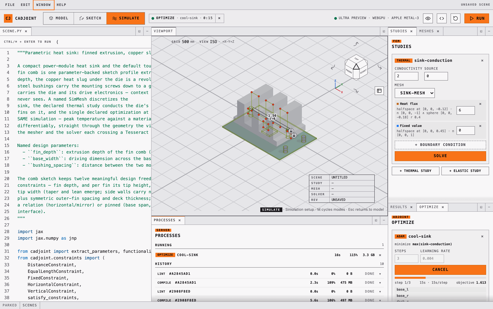
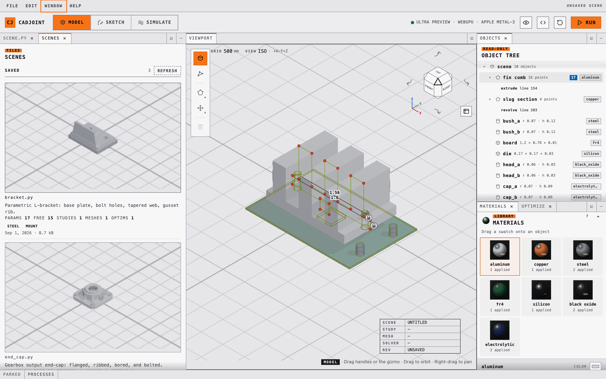

# cadjoint

Differentiable code-first CAD: sketches, constraints, SDF geometry, meshing and
FEM simulation composed into one function JAX can differentiate end to end.

> [!WARNING]
> The API is not stable. Expect breaking changes.

[![A fin tip of the heat sink is dragged upward in the viewport of the cadjoint playground. The fin grows with the pointer at frame rate while the rest of the comb stays put, the editor on the left holds the highlighted line fin2_tip_l = Vector2(value=[-0.15, 0.85], free=True, ...), and releasing the pointer writes the new coordinates into that literal and recompiles.](docs/assets/motion/parameter-drag.webp)](https://andrinr.github.io/cadjoint/docs/viewer.html)

*The whole idea in one gesture. The handle under the pointer is a named
`Vector2` in `scene.py`; dragging it writes the parameter buffer the shader
already reads, so the solid follows at frame rate without recompiling anything,
and the release patches the literal in the source. The source is the model —
there is no second copy of the geometry to drift out of sync with it.*

---

## The chain

One Python program declares the whole thing, and every arrow below is a
derivative JAX can take:

```
sketch vertices ─► constraints ─► SDF ─► mesh ─► FEM solve ─► objective
       └─────────────────────────── ∂J/∂θ ◄───────────────────────────┘
```

A sketch profile is a list of named `Vector2` parameters. Constraints are
residuals on those parameters, solved by Riemannian gradient descent and Newton
projection onto the constraint manifold. Extruding or revolving the profile
produces an SDF that *shares* those parameter objects, so the solid and the
sketch are the same variables. Dual contouring turns the field into a surface,
TetGen fills it (or Gmsh meshes it to second-order tets), jax-fem or CalculiX
solves on it — and `jax.grad` reaches from the objective all the way back to a
fin's tip coordinate.

Nothing in that chain is a snapshot. A work plane taken from a face
(`SketchPlane.on(body.cap("+"))`) is an *expression* over the parent feature's
parameters, so the volume of a boss extruded from it differentiates with respect
to its parent's depth — the thing a B-rep modeller cannot do, because there a
face is stored geometry rather than a function of the feature that made it
(`tests/construction/test_reference_planes.py`).

No boundary representation is stored either. The field is the model, and
everything that wants a surface derives one from it: dual contouring for the
mesh and the viewport, a lattice classifier over the same samples for the
feature-edge overlay, and coplanar-polygon merging for the faceted STEP the
exporter writes. Those are *approximations of* the surface, sampled at a
resolution you choose — good enough to mesh, solve, print and hand to another
tool, and honest about being faceted. Exact analytic faces are not part of this
repository; a handful of typed plugin kinds are extension points where a
provider can supply sharper implementations, and `cadjoint.tier` reports in one
sentence which of them are filled.

---

## Features

- **SDF primitives** — sphere, box, capsule, cylinder, torus, and more
- **Boolean ops** — union, intersection, subtraction with smooth blending
- **Transforms** — translate, rotate, scale, mirror, repeat, linear and polar
  patterns
- **Sketch construction** — 2D profiles on work planes, extruded, revolved or
  lofted into solids that share their parameters, so constraints and gradients
  act on both
- **Reference geometry** — sketch planes taken from a feature's own faces
  (`solid.cap("+")`, `solid.side(i)`, `block.face("+x")`), offset planes,
  midplanes, and tangent planes Newton-projected onto a field, all
  differentiable through the parent
- **Constraint system** — distance, angle, coincident, horizontal, vertical,
  parallel, perpendicular, equal-length, point-on-line and fixed (plus the
  edge-pair forms), solved by Riemannian gradient descent and Newton projection
  onto the constraint manifold
- **Extension points** — five typed in-process plugin kinds (`node_map`,
  `feature_edges`, `brep`, `step_export`, `drag`) with a working implementation
  each; a registered provider may replace any of them, and `cadjoint.tier` says
  in one sentence which are filled
- **Materials with physics** — density, conductivity, specific heat, Young's
  modulus, Poisson ratio, thermal expansion and yield strength in SI, through
  the same parameter containers as colour; a sourced catalogue in
  `cadjoint.materials`
- **Meshing** — dual contouring with sharp-feature QEF vertices, TetGen fill to
  TET4/TET10 behind an automatic refinement ladder, second-order tets through
  Gmsh sized by the part, or a deterministic voxelize-and-snap HEX8 path
- **FEM** — thermal and linear-elastic studies with programmatic node selections
  and properties sampled from the materials, solved by jax-fem or by CalculiX
  2.23 over a subprocess
- **Optimization** — declared in the scene, descended with optax, every step
  projected back onto the sketch constraints
- **Plugins** — every non-JAX component (mesher, tet fill, solvers, the flow
  prototype) is a Tesseract behind one `apply`/`vjp` interface, run in-process,
  in a container or on a remote service, wired up in a `plugins.toml`
- **Flow solver prototype** — D3Q19 lattice Boltzmann with Brinkman
  penalisation sampled from the scene SDF, gradient by the implicit function
  theorem at the steady state (`cadjoint/flow/`)
- **Forward raymarcher** — early-exit sphere tracing, reconstructed silhouettes,
  GGX materials, soft shadows, reflections, refraction, anti-aliasing
- **Shader backend** — compile 3D SDFs through StableHLO to WGSL
- **Browser playground** — a windowed WebGPU app where every edit rewrites the
  Python source that produced it, with solid, x-ray, wireframe, feature-edge,
  distance-slice, gradient, normal and depth views of the field
- **JAX-native** — every scene is a pure function; `jit`, `grad`, and `vmap` work
  out of the box; every fixed option set is a `StrEnum` in `cadjoint.enums`,
  accepted beside its plain string

---

## Install

Clone the repo and sync with
[uv](https://docs.astral.sh/uv/getting-started/installation/):

```bash
git clone https://github.com/andrinr/cadjoint
cd cadjoint
uv venv                     # create .venv (--python 3.12 pins a version)
uv sync                     # CPU JAX — macOS, Linux, and Windows
# uv sync --extra cuda      # Linux + NVIDIA GPU
uv run pre-commit install   # optional: lint and format on commit
```

`uv sync` installs cadjoint into `.venv` in editable mode — creating the
environment first if you skipped `uv venv`. Run commands through it with
`uv run <cmd>`, or activate it once per shell:

```bash
source .venv/bin/activate       # Windows: .venv\Scripts\activate
```

The default sync pulls plain `jax`/`jaxlib`, so it works on Apple Silicon and any
CPU-only machine. CUDA wheels are Linux-only, so GPU support is opt-in through
the `cuda` extra.

Optional extras — repeat the flag, one `--extra` per name:

```bash
uv sync --extra viewer --extra fem --extra editor --extra docs
```

| Extra | Pulls in |
| --- | --- |
| `cuda` | GPU JAX (Linux + NVIDIA only) |
| `viewer` | Jupyter widget (`anywidget`) and per-worker CPU/memory sampling for the playground's process monitor (`psutil`) |
| `editor` | playground editor intelligence (`jedi`, `ruff`) |
| `fem` | jax-fem finite-element stack (basix, meshio, petsc4py) |
| `tesseract` | tesseract-core + tesseract-jax, the plugin runtime |
| `gmsh` | Gmsh in-process for the `tet_gmsh` mesher (GPL; the container image keeps it at a process boundary) |
| `stepcheck` | OCCT kernel validation of STEP exports (dev) |
| `docs` | Quarto API reference (`quartodoc`) |

Avoid `--all-extras` on macOS — it includes `cuda`, which has no macOS wheels.

---

## The playground

```bash
uv run cadjoint-viewer --open   # serves http://127.0.0.1:8765/ and opens your browser
```

Equivalent invocations and options (drop `uv run` inside an activated `.venv`):

```bash
uv run python -m cadjoint.viewer.playground   # same server, no browser launch
uv run cadjoint-viewer --port 9000            # pick a different port
uv run cadjoint-viewer --help                 # list all flags
```

Then open <http://127.0.0.1:8765/> if you did not pass `--open`. No extra
dependencies are needed — the server is stdlib-only — but the preview needs a
WebGPU-capable browser (recent Chrome, Edge, or Safari). Stop the server with
`Ctrl+C`. Saved scenes live in `./scenes` under the server's working directory
(`CADJOINT_SCENES_DIR` points it elsewhere), and the server warms its
compilation cache for every shipped scene at launch.

Edit the program on the left and run it with `Ctrl+Enter` (or `Cmd+Enter`). It
must assign its final SDF to `scene`. The server only listens on localhost and
compiles each edit in a timed child process, but the editor still executes
Python on your machine — only run code you trust.

### Panels are windows

Every panel is a dockview window: drag its tab to split or stack, minimise it to
the tray along the bottom, float it out over the desk, close it and bring it
back from the **Window** menu. The viewport is the one exception — it is
furniture and has no close control. The windows are `scene.py`, **Objects**,
**Materials**, **Sketch**, **Meshes**, **Studies**, **Results**, **Optimize**,
**Scenes** and **Processes**; the last two are parked in the tray in every desk.
Arrangements survive a reload, and each mode remembers its own desk, so
switching to Simulate and back restores what you left in Model.


*Objects dragged onto the editor's tab strip, floated back out over the desk,
then Materials parked in the tray and brought back — all with the dock's own
controls, no modes and no dialogs. The WebGPU canvas is re-parented, not
rebuilt, so the context survives every drag, dock and mode change: the sink
never blinks (`frontend/e2e/windows.spec.ts`).*

Three modes seed the default desks — **Model**, **Sketch**, **Simulate** —
cycled with `M` (`Shift+M` backwards, `Esc` returns to Model). Selecting a
sketch in the viewport enters Sketch mode on its own; the two side columns keep
the same widths in all three modes so a mode change never moves the model out
from under the pointer. Simulate is not a second application: its desk is the
same viewport and editor with Studies, Meshes, Results and Optimize in the
right-hand column, and any of those windows can be opened in any mode.

### The viewport

The chrome and the viewport are the same sheet of paper: the seam between them is
a rule, not a step in luminance. Inside the rectangle nothing is coloured, so the
only hue there is a measurement — the viridis field ramp, the magma quality ramp,
the boundary-condition hues, the axis triad.

- a **Z-up camera** over a **world-space floor grid** at z = 0, with the spacing
  of the ruling printed as a scale readout that follows the zoom
  (`GRID 1.00 m`, `GRID 500 mm`), so the view is calibrated rather than
  decorative
- a **title block** in the corner naming the scene, study, mesh, solver and
  revision — the state you would otherwise hunt through panels for
- a **navigation cube** in the FreeCAD lineage: a chamfered cube whose six
  faces, twelve bevels and eight corners are the twenty-six standard views;
  four quarter-arc controls on its flanks, each a quarter turn about one of
  the camera's own screen axes (the arc *is* the ninety degrees, the head says
  which way); an axis triad in the lower-left corner and the projection
  toggle in the lower-right. Nothing on the cube changes the projection —
  a corner is a direction, the toggle is orthographic or perspective. The
  keyboard has the same rose —
  `1` / `3` / `7` for front, right and top (`Ctrl` for the opposite), `9` to
  turn around, `5` for the projection
- a **construction overlay** — sketch profiles, vertex handles, constraint
  dimensions and gizmos, depth-tested against the solid (an edge behind the model
  is hidden by it) — toggled from
  **Display options → Customize → Construction overlay**
- **render presets** behind the same button — X-Ray, Studio, Wire — with
  shading, shadow and quality controls (Ultra is the default), and
  **path tracing** for
  progressive multi-bounce lighting, GGX reflections and glass transport;
  camera and scene changes reset the accumulation automatically


*One left-drag, orbiting. The cube in the corner is not a decoration: it turns
with the camera and names the standpoint the view has reached, and the readout
prints the ruling's real spacing, so the view is calibrated rather than
decorative. The arc passes under the floor deliberately — the light follows the
camera, so the underside of a part is lit rather than a silhouette. Right-drag
pans and the wheel zooms; the construction overlay above can be switched off
for a presentation frame, and the graticule stays, held below the contrast a
meaningful mark owes (`frontend/test/graticule.test.ts`).*

The display modes are one set, and all of them are views of the same compiled
field: **solid**, **x-ray**, **mesh wireframe**, **feature edges**, a signed
**slice** of the distance field on any axis, its **gradient magnitude**, an
**iso-offset**, **normals** and **depth**.


*The distance field cut open and the cut dragged through the part. The plane
shows the signed value at every point on it — inside and outside — with
contours at the grid spacing and a fifth of it, densest within two intervals of
the surface, and the readout over the viewport prints the plane's actual
coordinate rather than a slider fraction. Watch the rings pinch shut as the
plane crosses a fin: that is the field's zero set, which is the surface, and it
is the same field the mesher contours and the shader marches. The gradient view
beside it shows |∇f|, the diagnostic that says where a field has stopped being a
metric distance.*

The **feature-edge** overlay comes from a lattice classifier over the same
samples: a cell whose corner signs and gradients disagree by more than the
crease threshold is an edge cell, and the edges are drawn from the dual-contour
vertices those cells produced. It is a sampled reading of where the creases are,
not an exact intersection curve, and it sharpens with the lattice resolution.

### Model mode: direct editing that rewrites the source

Construction geometry is editable in place, and every edit is applied to the
Python program, which stays the single source of truth — there is no hidden scene
state to drift out of sync.

| Action | Result |
| --- | --- |
| Click a vertex handle | Selects it and highlights the exact literal in the code |
| Drag a handle | Rewrites that vertex's coordinates and rebuilds the solid |
| **P**, then click edges | Inserts a vertex per click until Esc |
| Select a handle, press Delete | Removes that vertex |
| **B** / **S** / **C**, then click | Writes a `Solid.*` call and adds it to the scene |
| Click a solid's outline | Selects it and shows the move/rotate gizmo (**G** / **R**) |
| Drag a gizmo arrow or ring | Rewrites `position=` or `rotation=` on that solid |
| Drag a material swatch onto a solid | Rewrites its `material=` argument |
| Edit a property in the material inspector | Rewrites `density=`, `conductivity=`, … on that `Material` |
| Hover a face, click it | Highlights the face and writes `SketchPlane.on(...)` for the active sketch |
| Drag empty space / Shift-drag or right-drag / scroll | Orbit / pan / zoom |

Geometry whose literals cannot be rewritten (built in a loop, or from a variable)
still renders, but is read-only in the viewer.

Solids created this way come from the construction layer, so they are ordinary
parametric geometry as well as viewer objects:

```python
from cadjoint.construction import Solid
from cadjoint.sdf.boolean import Union

scene = Union(
    Solid.box(size=[1, 1, 0.5], position=[0, 0, 0], rotation=[0, 0, 0.4]),
    Solid.sphere(radius=0.6, position=[1.5, 0, 0]),
)
```

`size`, `position`, and `rotation` become named free parameters shared with the
SDF the factory returns, so constraints and `jax.grad` reach them exactly as they
do for sketch vertices. `size` is half-extents and `rotation` is intrinsic X, Y, Z
angles in radians, matching the underlying primitives.

### Materials carry their physics

A `Material` has two populations of properties. Colour, roughness, metallic,
opacity, IOR and reflectivity are what the renderer uses; density,
conductivity, specific heat, Young's modulus, Poisson ratio, thermal expansion
and yield strength — in SI, through the same parameter containers, so any of
them can be `free` and traced — are what the solver uses.

```python
from cadjoint.materials import aluminium_6061, copper_c11000

sink = extrude(comb_profile, depth=fin_depth, material=aluminium_6061())
slug = revolve(slug_profile, material=copper_c11000())
```

`cadjoint.materials` is a sourced catalogue — aluminium 6061, copper C11000,
steel 1018, Ti-6Al-4V, FR-4, silicon, a thermal pad, PLA — of factories, not
singletons, so marking one scene's copper `free` cannot leak into another. A
study defaults to taking its conductivity, `E` and `ν` *from the materials*,
sampled per element from the field the smooth booleans already blend, so a
copper slug in an aluminium sink simulates as two materials, differentiably
through both the values and the interface; an explicit
`ThermalStudy(conductivity=2.0)` still overrides it. The Materials window edits
every physical row in place and writes the keyword back into the `Material(...)`
call — a row the declaration does not state is offered, not invented
(`frontend/src/materialProperties.ts`).

### Sketch mode: constraints on the geometry they hold


*Fix a point, dimension a pair, retype the dimension, solve. Numeric distances
draw as dimensions in the viewport; relational constraints (horizontal,
vertical, equal-length) are chips in the Sketch window. Every one of those
clicks writes a `FixedConstraint(...)`, a `DistanceConstraint(...)` or a
`satisfy_constraints(...)` back into `scene.py` — the panel is a view of the
program, not a parallel model of it.*

The solver is exposed, not hidden: pick the method and iteration count, run it,
and the loss curve is drawn beside the chips. `satisfy_constraints(...)` appears
in the source with the settings you chose. A redundant constraint no longer
turns the model into NaN — the Newton projection takes a least-squares step when
`J Jᵀ` is singular (`72e6a52`).

### Sketching on a face

A work plane can be taken from a feature's own face rather than typed as a
coordinate frame:

```python
body = extrude(profile, depth=fin_depth)
boss = PolygonProfile(SQUARE, plane=SketchPlane.on(body.cap("+")))
```

`body.cap("+")` / `body.cap("-")` are the ends of a sweep, `body.side(i)` the
wall swept by profile edge `i`, and `block.face("+x")` a primitive's face — all
analytic, never mesh-derived, and differentiable through the feature.
`SketchPlane.offset(reference, distance)` pushes a plane along its normal (the
distance may itself be a `Scalar` design variable),
`SketchPlane.midplane(face_a, face_b)` sits between two faces, and
`SketchPlane.tangent(...)` Newton-projects onto a field for everything with no
analytic face — blends, fillets, the curved wall of a revolve. In the viewport,
hovering a face highlights it and clicking issues a `set_sketch_plane` patch,
which rewrites the plane argument in place. Faces also carry the tools that cut
them — holes and pockets are declared against the face they enter
(`scenes/end_cap.py` is the worked example, `research/complex-scene.md` the
report of what it broke).


*Hover a face, and the hint names the accessor the click is about to write —
`sink.cap('-')`, resolved from the feature that made the face rather than
looked up in a stored surface. Clicking issues the patch, and the plane the new
sketch sits on is from then on an expression in the parent's parameters: change
`fin_depth` and the sketch follows.*

### The Simulate desk


*One click, and the chain in the diagram above runs end to end: the field is
sampled on the declared lattice, dual-contoured, filled with TET10 tets, and
solved. Boundary conditions are programmatic node selections
(`Nodes.halfspace(...) & Nodes.sphere(...)`), listed with the region they
resolve to; add one by picking a region in the viewport and the study is
rewritten in the source. The legend is a labelled bar, because a ramp with no
numbers beside it is decoration, and elastic studies report mass and a safety
factor against the materials' yield strength as well. Meshes has the same
treatment for the discretization — resolution, padding, bounds, domain and
method editable in place, with the aspect-ratio histogram under them, and an
automatic refinement ladder when a tet grid self-intersects.*

A solved field lives in the server's job registry, not only in the response, so
it survives closing the window, switching modes and reloading the page.

### Processes



*Processes, opened from the Window menu while an optimization runs. Every
request that costs real time — compile, mesh, inspect, solve, optimize, lint,
the startup warm-up — is a job in `cadjoint/viewer/_jobs.py` with a status,
timestamps, the source hash it ran against, and its worker's CPU and memory
sampled once a second (`psutil` from the `viewer` extra; without it the window
says it is degraded to `rusage` totals). A running job shows as a chip in the
mode strip from any desk, with a cancel that kills the actual worker; a finished
one is re-openable from the history.*

### Scenes



*Scenes browses the scene directory without running a line of it: each card's
summary, parameter, study, mesh and material counts come from an `ast` pass on
the server (`cadjoint/viewer/_scenes.py`), and only the picture costs a compile,
cached by source hash. Opening one goes through the same guarded path as
**File → Open**. The scene being opened here is `scenes/motor_shield.py`, which
exists to find the ceiling of the modelling language rather than to be pretty —
a helical cooling channel swept as a field, a bolt circle and a knurl as polar
patterns, eight materials and 41 free parameters, and a compile that takes
tens of seconds. The clip plays that compile at about nine times life.*

Five scenes ship: `scenes/starter.py`, the heat sink on its board;
`scenes/bracket.py`, the parametric L-bracket the command-line optimization
below descends; `scenes/end_cap.py`, a gearbox output end-cap with a stepped
bearing seat, eight patterned ribs, bolt holes and an oil port;
`scenes/motor_shield.py`, the stress test above; and `scenes/duct_sink.py`, a
finned sink inside a duct — the case the flow prototype exists for.

### Export

**File → Export…** is a small form: the format, what to export, how fine, the
one option the format has, and Export. **STL** (binary or ASCII) and **OBJ**
(planar faces merged or not) carry the dual-contoured surface of one object at
the resolution you choose. **STEP** is written from that same surface: coplanar
triangles are merged into polygonal faces and emitted as a faceted B-rep solid,
so a curved wall arrives as a fan of planar facets rather than a cylinder, and
the file's fidelity is the lattice resolution you asked for. It opens in OCCT
and in the CAD tools that read AP214, and it is the right thing to hand a
downstream tool that needs a solid rather than a mesh; it is not a substitute
for a modelling kernel's analytic surfaces. (`step_export` is a plugin kind, so
a registered provider can write something sharper; the report says which writer
produced the file.) **VTK** writes a declared study's solved fields. The run is
a job like any other (`POST /api/export`), so the chip beside the mode switcher
counts the seconds and can cancel it, and the download is named after the scene
and the object (`heatsink-scene.stl`). The public writers are the Python API:
`cadjoint.meshing.export.save_obj`, `save_stl` and `save_step`.

### Editor intelligence

The playground server exposes `POST /api/lint`, `/api/complete` and
`/api/signature` (`cadjoint/viewer/_intelligence.py`). Lint shells out to `ruff`;
completion and signature help drive `jedi` in-process against the environment the
server itself runs in, so completions know the real signatures — and carry the
real docstrings — of `extrude`, `SketchPlane.on`, `ThermalStudy` and everything
else in `cadjoint`. The editor shows squiggles and gutter marks with severity
carried by shape as well as hue, one-click fixes, a documentation panel on
completions and a signature tooltip that follows the caret; a failed compile's
traceback is reported as an error on the offending line. Both dependencies are
optional — install them with `--extra editor`; without them the endpoints answer
with an install hint and the editor simply goes quiet. Everything is static:
a test lints a file-deleting scene harmlessly.

### Developing the playground UI

The UI is a Solid + TypeScript app in `frontend/`, built into
`cadjoint/viewer/static` and committed, so installing cadjoint needs no Node
toolchain. To work on it:

```bash
cd frontend
npm install
npm run dev        # Vite on :5173, proxying the API to the Python server
npm run build      # refresh cadjoint/viewer/static (commit the result)
npm test           # 32 unit suites: projection, picking, tokens, graticule, windows, jobs, scenes
npm run e2e        # Playwright, drives the real server end to end
```

Run `uv run cadjoint-viewer` alongside `npm run dev` so the dev server has an API
to proxy to. The design system is specified in
[`research/design-language.md`](research/design-language.md), and
`frontend/src/tokens.ts` is its source of truth —
`frontend/test/tokens.test.ts` asserts the CSS cannot drift from it. The payload
and every patch request are pydantic models in `cadjoint/viewer/schema/` with
generated TypeScript, and every editable thing has a stable identity derived
from its AST path and name (`assign:comb_profile`, `bc:sink-conduction[1]`)
that survives lines being inserted above it.

---

## Shader compilation and the Jupyter viewer

Compile an SDF to a standalone shader function:

```python
from cadjoint.backends import compile_sdf_to_wgsl, compile_scene_to_wgsl
from cadjoint.sdf.primitives import Sphere

sphere = Sphere(radius=1.0)
wgsl = compile_sdf_to_wgsl(sphere)
wgsl_scene = compile_scene_to_wgsl(sphere)
```

`compile_scene_to_wgsl` emits `sdf`, `material_base` (RGB + roughness), and
`material_optics` (metallic + opacity + IOR + reflectivity) from the same scene
snapshot, ready to embed in a WebGPU renderer.

The Jupyter viewer is an optional dependency:

```bash
uv sync --extra viewer
```

```python
from cadjoint.viewer import SDFViewer

SDFViewer(sphere)
```

See the [rendering notebook](examples/rendering.ipynb) for composition and
hot-reload examples, and the
[WebGPU viewer guide](https://andrinr.github.io/cadjoint/docs/viewer.html) for a
live interactive scene, camera controls, generated-shader inspection and the
widget.

## Forward rendering

The image renderer groups scene data and quality controls explicitly:

```python
from cadjoint.render import Camera, RenderSettings, Scene, render_scene
from cadjoint.sdf.primitives import Sphere

scene = Scene(
    Sphere(1.0),
    camera=Camera(position=(0, 1.5, 5), target=(0, 0, 0)),
)
image = render_scene(scene, RenderSettings.balanced((240, 320)))
```

Use `RenderSettings.draft()`, `.balanced()`, or `.high_quality()` to choose an
explicit performance/fidelity trade-off. See the
[forward renderer guide](https://andrinr.github.io/cadjoint/docs/rendering.html)
for mode and quality comparisons.

---

## The worked example: `scenes/starter.py`

The scene the playground opens with is a parametric power-module heat sink, and
it exercises the whole chain in one file:

- a **fin comb** — one `PolygonProfile` of 16 named `Vector2` points, extruded
  through a named `fin_depth`, held by 17 constraints that still leave twelve
  real design freedoms
- a **copper slug** revolved from a four-point section, and two steel bushings
  whose spacing is a `DistanceConstraint`, blended into the comb at `k = 0.03`
- **materials that state their physics** — the aluminium, copper and steel
  carry real densities, conductivities and elastic constants, so the mass and
  the safety factor in a result mean something (the scene is unit-scale, so the
  thermal study keeps an explicit conductivity)
- **board-level context** — FR4 board, die, screw heads, capacitors — rendered so
  the part reads as a module, and kept out of the physics by `domain=thermal_body`
  on the mesh, so every mesh, solve and gradient is identical to the thermal body
  alone
- a **`SimMesh`** on a named lattice (`method="tet10"`)
- a **`ThermalStudy`** whose die heat flux and ambient Dirichlet region are
  programmatic node selections
- an **`Optimization`** that descends that same study — peak temperature against a
  material-volume regularizer, twelve Adam steps — with `gradient_path="tesseract-dc"`

Running `cool-sink` from the Optimize window drives exactly that chain in the
browser, streamed step by step, and writes its new parameter values straight back
into the source.


*Twelve Adam steps of `cool-sink`, played at about seven times life — every
frame is one the app drew. Each step meshes the current design, solves the
thermal study on it, takes the adjoint back to the sketch parameters and
projects the update onto the constraints; the sparkline is the objective, peak
temperature, falling. When it finishes, the card becomes a replay: the scrubber
ghost-compiles any step's parameters back into the viewport, and the table
below gives every parameter's before → after. The optimizer writes the new
values straight into `scene.py`, which is why the card then marks itself stale —
the source it ran against has changed, by its own hand. A study-backed run also
publishes the optimized design's solved field, so the result lands in Results
with its temperature attached, and the run survives a mode switch or a reload by
job id.*

## End-to-end optimization from the command line

The pipeline is differentiable from the first named dimension to the last solver
residual, and `examples/fem_bracket_optimization.py` walks the whole chain on the
parametric L-bracket from `scenes/bracket.py`:

**named CAD parameters** (`web_thickness`, `rib_height`, `plate_thickness`)
→ **bracket SDF** → **HEX8 mesh** (frozen topology, node positions recomputed
differentiably per candidate) → **linear elastic solve** (jax-fem adjoint, or
CalculiX's native `*SENSITIVITY` via `--backend calculix`) → **compliance +
mass objective** → **optax Adam** with box-bound projection.

Meshing splits into a discrete half (which cells are inside, how they connect)
and a continuous half (where the nodes sit). The discrete half cannot be
differentiated, so topology stays frozen while gradients flow through the node
positions, and every few steps the mesh is re-extracted at the current design —
the small objective jumps at those steps are the discretization being refreshed.

```bash
uv pip install optax                              # optimizer (one-off)
uv run python examples/fem_bracket_optimization.py            # ~10 min, CPU
uv run python examples/fem_bracket_optimization.py --smoke    # 2 cheap steps
```

Requires the `fem` extra (`uv sync --extra fem`). The run validates the adjoint
gradient against finite differences, descends for 30 steps, prints a summary
table, and writes convergence CSV + figure and before/after VTK files to
`examples/output/`.

---

## Plugins: one differentiable function across every tool boundary

Real engineering pipelines die at tool boundaries — a Fortran solver here, a
Rust kernel there, a mesher nobody can differentiate — and the gradients die
with them. cadjoint crosses those boundaries with
[Tesseract](https://github.com/pasteurlabs/tesseract-core): every non-JAX
component is packaged as a Tesseract exposing typed `apply` and
`vector_jacobian_product` endpoints, and
[tesseract-jax](https://github.com/pasteurlabs/tesseract-jax) lifts each one
into a JAX primitive. The result is a single function from CAD parameters to
engineering objective that `jax.grad` differentiates end to end, even though
no two stages agree on how to compute a derivative.

What cadjoint's own code sees is a **kind** — `mesher`, `tetfill`,
`tet_mesher`, `thermal_solver`, `elastic_solver`, `flow_solver` — filled by a
plugin (`cadjoint.plugins`, deliberately thin: schemas and differentiable
inputs come from the runtime's own OpenAPI document, `apply`/`vjp` are the
client's methods, the JAX bridge is one `partial(apply_tesseract)`). A
`PluginSpec` is the only thing that knows *where* a plugin runs, and each
transport is exactly one tesseract-core constructor:

| transport | the call it makes | when |
| --- | --- | --- |
| `local` | `Tesseract.from_tesseract_api(api_path)` | default — same process, no Docker, no serialization |
| `container` | `Tesseract.from_image(image)` | a component that needs isolation, or a licence boundary |
| `remote` | `Tesseract.from_url(url)` | a served instance, on this machine or a cluster |

Which plugin fills which kind, and where, is a `plugins.toml` (found at
`$CADJOINT_PLUGINS`, else `~/.config/cadjoint/plugins.toml`); a table whose
name matches a built-in *replaces* its spec, which is how the thermal solver
moves from this process to a cluster URL without a line of code changing.
Third-party components register through the `cadjoint.plugins` entry-point
group. Remote and local agree bit for bit on the mesher's apply and VJP. The
full contract is in the [plugins guide](https://andrinr.github.io/cadjoint/docs/plugins.html).

### The Tesseracts in this repo

| Tesseract | Kind | Wraps | Boundary crossed | How its VJP works |
| --- | --- | --- | --- | --- |
| `cadjoint/fem/tesseracts/thermal_jaxfem` | `thermal_solver` | jax-fem Poisson solve | AD strategy: JAX cannot trace the solver (PETSc assembly) | Implicit adjoint — one transposed linear solve per cotangent |
| `cadjoint/fem/tesseracts/elastic_jaxfem` | `elastic_solver` | jax-fem linear elasticity + von Mises | same | same; gradients bit-identical to the in-process path |
| `cadjoint/fem/tesseracts/elastic_calculix` | `elastic_solver` | **CalculiX 2.23, Fortran**, over a subprocess (text decks in, result files out) | Language, licence (GPL-2 isolated), and AD strategy | The solver's native `*SENSITIVITY` discrete adjoint, plus a correction we derived for a missing Jacobian-variation term in ccx 2.23 — validated to 2e-4 of finite differences |
| `cadjoint/fem/tesseracts/tetfill` | `tetfill` | **TetGen** — the tet fill alone, with dual contouring left differentiable in JAX upstream | A discrete meshing algorithm, cut at the narrowest place it can be cut | **Pass-through gather**: TetGen's `-Y` preserves the input vertices bit-for-bit, so the VJP is the exact transpose of a gather (0.0 relative error for TET4, 1.25e-16 for TET10); Steiner nodes take zero cotangent, and interior relaxation carries their sensitivity onto the boundary |
| `cadjoint/fem/tesseracts/mesher` | `mesher` | The **whole black-box mesher** — dual-contoured surface into a tetrahedral volume mesher whose internals nobody differentiates | The boundary everyone gives up on: a discrete, non-differentiable meshing algorithm | **Surface-interpolation VJP**: a boundary vertex lies on the zero set of the trilinearly interpolated SDF samples, so the implicit function theorem gives `∂v/∂fᵢ = −wᵢ(v)·∇f/|∇f|²` — the interpolation weights at the frozen vertex locations *are* the VJP rows. Any mesher becomes differentiable without touching its internals; only the Hadamard-meaningful normal motion is carried |
| `cadjoint/fem/tesseracts/tet_gmsh` | `tet_mesher` | **Gmsh** (HXT, second order) on the faceted STEP the exporter writes | Licence (GPL-2-or-later isolated) and a discrete topology decision | **No gradient path.** Gmsh meshes the exported solid and returns nodes that are not tied back to the design parameters, so this route is for getting a good second-order mesh, not for differentiating through one — use `tetfill` or `mesher` when the gradient has to reach the CAD |
| `cadjoint/fem/tesseracts/flow_brinkman` | `flow_solver` | The D3Q19 lattice-Boltzmann flow prototype in `cadjoint/flow/` | No mesh at all: the design enters as a solid fraction sampled from the SDF | Implicit function theorem at the converged fixed point — 457 MB where an unrolled tape needs 21 GB, finite differences matched to 3e-8 (`research/flow-solver.md`) |

### The composition

```
CAD parameters θ  ──►  constraints ──► SDF        (JAX autodiff)
        │                              │
        │                              ▼
        │                  dual-contoured surface   (JAX autodiff:
        │                              │             Newton on the true SDF)
        │                              ▼
        │              ┌─ tetfill plugin ────────┐ (TetGen; frozen topology,
        │              │  surface → TET4/TET10   │  exact pass-through VJP)
        │              └───────────┬─────────────┘
        │                          ▼
        │              ┌─ solver plugin ─────────┐ (jax-fem adjoint, or
        │              │  thermal / elastic FEM  │  CalculiX Fortran adjoint)
        │              └───────────┬─────────────┘
        │                          ▼
        └──────────  ∂J/∂θ  ◄──  objective J      (JAX autodiff)
```

**This is what the playground runs.** The starter scene's `cool-sink`
optimization declares `gradient_path="tesseract-dc"`, so running it from the
Optimize window drives exactly this chain, streamed live, with the optimized
parameters written back into the source. `gradient_path="direct"` runs the same
objective fully in-process for comparison.

A second, more general boundary also ships: the `mesher` Tesseract wraps the
*whole* pipeline (samples → surface → mesh) and derives its VJP from the
interpolated field alone, so it differentiates meshers that do not preserve
their input vertices — at the cost of the interpolant smearing sharp features.
`tetfill` is sharper wherever TetGen's vertex-preserving mode applies;
`mesher` is the one to reach for when the mesher is a true black box (and it
carries the HEX8 path). Numbers for both: `research/tet-vs-hex.md`.

`examples/fem_bracket_optimization.py` runs this loop for real: optax Adam over
named CAD parameters, objective down 73% in 30 steps, adjoint checked against
finite differences at every boundary (2e-5 … 3e-7 per parameter), and
`--backend calculix` swaps a 1990s Fortran code into the same `jax.grad` call
without changing a line of the objective.

### Why Tesseract is load-bearing here

- **CalculiX cannot be traced, linked, or relicensed** — it is GPL-2 Fortran
  speaking input decks. The Tesseract boundary is what lets its native adjoint
  compose with JAX autodiff while staying a subprocess. Gmsh is the same story
  for meshing: `tet_gmsh` keeps the GPL at a process boundary.
- **The mesher VJP is a contract, not a computation** — the surface-
  interpolation map is defined at the Tesseract boundary from the *inputs and
  outputs alone*, which is what makes swapping TetGen, fTetWild, or gmsh
  behind it a zero-cost experiment.
- **Solvers are plugins.** `SolverBackend` routes `backend="jaxfem" | "tesseract"
  | "calculix"` through one ABI, and the plugin registry decides which
  Tesseract answers a kind; the survey in `research/simulator-ecosystem.md`
  ranks 31 further candidates (jwave, JAX-Fluids, MJX, …) that drop into the
  same slot.
- **It stays fast.** Tesseracts here run in-process via
  `Tesseract.from_tesseract_api` — no Docker, ~0.14 s per apply/VJP roundtrip —
  with containerization available when a component needs isolation.

### Building and serving them as containers

Each of the seven directories above is a complete Tesseract package —
`tesseract_api.py` plus `tesseract_config.yaml` plus a requirements file — so
`tesseract build` turns it into a Docker image with no extra glue:

```bash
uv sync --extra tesseract          # installs the tesseract-core SDK
tesseract build cadjoint/fem/tesseracts/mesher          # ~1 min
tesseract build cadjoint/fem/tesseracts/elastic_calculix # ~1.5 min
tesseract build cadjoint/fem/tesseracts/thermal_jaxfem  # ~3 min
tesseract build cadjoint/fem/tesseracts/elastic_jaxfem  # ~3 min
tesseract build cadjoint/fem/tesseracts/tet_gmsh
tesseract build cadjoint/fem/tesseracts/flow_brinkman
```

Then serve one and call it like any other Tesseract — the same client code
that runs it in-process runs it in a container:

```python
from tesseract_core import Tesseract

with Tesseract.from_image("cadjoint_mesher:latest") as t:
    points = t.apply(inputs)["points"]
    grads = t.vector_jacobian_product(
        inputs, vjp_inputs=["field_values"],
        vjp_outputs=["points"], cotangent_vector={"points": cotangent},
    )
```

`tesseract serve <image>` plus `Tesseract.from_url(...)` works identically for
a long-lived server — and a `plugins.toml` entry with `transport = "remote"`
makes it the plugin the whole pipeline uses. What the measured images contain,
and what they cost:

| Image | Requirements provider | The non-obvious payload | Size |
| --- | --- | --- | --- |
| `cadjoint_mesher` | pip | cadjoint + TetGen + SciPy on a uv-installed CPython 3.12 | 1.36 GB |
| `cadjoint_elastic_calculix` | conda | **the ccx 2.23 Fortran binary** from conda-forge at `/python-env/bin/ccx`, pinned via `CADJOINT_CCX` | 2.57 GB |
| `cadjoint_thermal_jaxfem` | conda | the full jax-fem stack: PETSc/petsc4py 3.25.5, gmsh, fenics-basix, meshio | 5.51 GB |
| `cadjoint_elastic_jaxfem` | conda | same | 5.51 GB |

Four packages use pip (`tesseract_requirements.txt`), three use the SDK's conda
provider (`tesseract_environment.yaml`) — because petsc4py publishes *no* PyPI
wheels at all and gmsh publishes manylinux wheels for x86-64 only, so the
jax-fem stack is simply not pip-installable on Linux, and ccx is a Fortran
binary that no Python requirement can supply. In every case cadjoint itself
is installed as a local path dependency (`../../../..`), which `tesseract
build` stages into the build context automatically.

Two behaviours to know when calling a *served* image rather than an
in-process one (both are properties of tesseract-core 1.11, not of cadjoint):

- **Zero-size arrays cannot cross the HTTP boundary.** Polymorphic array
  dimensions validate as `PositiveInt`, so an empty `(0, …)` input is
  rejected. The mesher's discovery mode (empty `point_ids` / `cell_template`)
  therefore has to run in-process; pass the frozen topology it returns to the
  served image.
- **TetGen topology is platform-dependent.** The same field meshes to 182
  points on macOS/arm64 and 185 in the Linux container, so a frozen-topology
  promise made on the host does not transfer to the container for TET4/TET10.
  HEX8 (voxelize + Newton-snap) is deterministic across both.

`tests/fem/test_tesseract_packaging.py` validates every package against the
installed SDK schema without Docker, and round-trips the built images against
the in-process path when Docker is present.

Design notes: `research/fem-integration.md` (solver ABI, adjoint mechanics,
the ccx sensitivity correction, container conformance and measured numbers)
and `research/tet-vs-hex.md` (the mesher-Tesseract validation matrix).

---

## Performance

Every playground request runs in a fresh subprocess, so JAX is pointed at a
persistent on-disk compilation cache (`cadjoint/cache.py`,
`CADJOINT_CACHE_DIR`); a later process reuses executables an earlier one
compiled. Measured on the starter scene, worker end to end: `compile` 2.1 s →
1.0 s, `mesh` with feature edges 12.2 s → 5.8 s.

[`research/performance.md`](research/performance.md) profiles every worker mode
and ranks the remaining levers by evidence. The short version: the hot path holds
no algorithm, library or language problem — the whole discrete dual-contouring
pipeline is 3–8 ms, the FEM linear solve 47 ms, TetGen 11 ms, JSON serialisation
1–5 ms. What the seconds are is JAX re-tracing and re-dispatching the scene in
eager mode, and XLA compiling shape-specific programs no two requests share.
The measured wins are implemented: the frozen study objective is jitted once per
topology (an optimizer step 12.7 s → 0.55 s, identical to 13 digits), the seam
projections are batched into one program (the seam block 5.59 s → 0.685 s), the
sharp-edge layer is restricted to the design subtree, and the server warms the
cache at start.

**The compiled programs are structured instead of flattened**
([§12](research/performance.md)). The trace used to unroll the object graph —
every profile vertex its own chain of ops, every pattern copy re-traced, shared
subtrees emitted twice, every parameter baked in as a literal. Profiles are now
one `(N, 2)` array with one `min` and a parity count; patterns trace their child
once under `vmap`; a node evaluated more than once becomes a nested `jit` that
StableHLO keeps as a `func.call` and the WGSL emitter maps to one function; and
`functionalize_parametric` takes parameter values as arguments, so the
persistent cache sees one program across value edits. On the gearbox end-cap the
gradient program went from 1.62 MB to 0.58 MB of HLO and from 25.4 s to 0.68 s
to compile; the worker's `mesh` mode from 106.7 s to 42.4 s cold and from
~40 s to ~16 s warm; the starter's values are bit-identical. There is no
second IR, and §12.10 argues why one would not buy more than this.

---

## Research notes

- [`research/design-language.md`](research/design-language.md) — the settled
  design specification: the paper ground, the ink and rule ladders, why the
  accent is only ever a fill, and the zoning rule that made panels dock
- [`research/performance.md`](research/performance.md) — the measured profile of
  every worker mode, each speed-up avenue ranked, and the structured lowering
- [`research/differentiable-meshing-pipeline.md`](research/differentiable-meshing-pipeline.md)
  — architecture of `cadjoint/meshing`
- [`research/native-mesher.md`](research/native-mesher.md) — the retired Rust
  dual-contouring core: what it measured, and why it was removed
- [`research/fem-integration.md`](research/fem-integration.md) — the
  `SolverBackend` ABI, adjoint mechanics, the ccx 2.23 sensitivity correction
- [`research/tet-vs-hex.md`](research/tet-vs-hex.md) — the mesher-Tesseract
  validation matrix
- [`research/flow-solver.md`](research/flow-solver.md) — the lattice-Boltzmann
  prototype, the shape of the penalisation, and what cooling a real sink would
  take
- [`research/complex-scene.md`](research/complex-scene.md) — what modelling the
  gearbox end-cap broke, what was fixed, and what was left alone
- [`research/end-to-end-optimization.md`](research/end-to-end-optimization.md) —
  the measured run record of the bracket showcase
- [`research/path-tracing.md`](research/path-tracing.md) — the browser
  path-tracing mode
- [`research/constraints.md`](research/constraints.md) and
  [`research/simulator-ecosystem.md`](research/simulator-ecosystem.md) — what is
  next in each

## Tests

```bash
uv run pytest tests/
```

## Docs

Requires [Quarto](https://quarto.org/docs/get-started/) and the `docs` extras:

```bash
uv sync --extra docs
uv run quartodoc build   # generate API reference from docstrings
quarto preview           # serve locally at localhost:4321
```

## Tesseract Hackathon 2026

cadjoint was an entry in the
[Tesseract Hackathon 2026](https://si-tesseract.discourse.group) (Track 01 —
inverse design & shape optimization). That state is frozen on the branch
[`tesseract-hackathon-2026`](https://github.com/andrinr/cadjoint/tree/tesseract-hackathon-2026),
which is kept permanently; development continues on `main`. The geometry
foundation predates it; the meshing pipeline, every Tesseract, the CalculiX
adjoint correction, the mesher VJP and the end-to-end optimization were written
during the hackathon window (Aug 3–31, 2026), verifiable commit-by-commit on that
branch.

---

Inspired by [Fidget](https://www.mattkeeter.com/projects/fidget/) and
[Inigo Quilez's distance functions](https://iquilezles.org/articles/distfunctions/).

## License

[Apache License 2.0](LICENSE).
