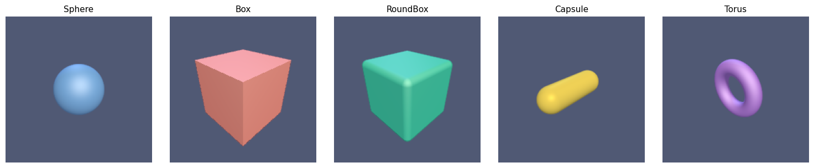
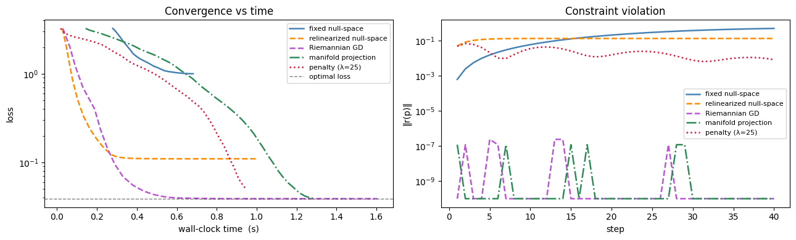
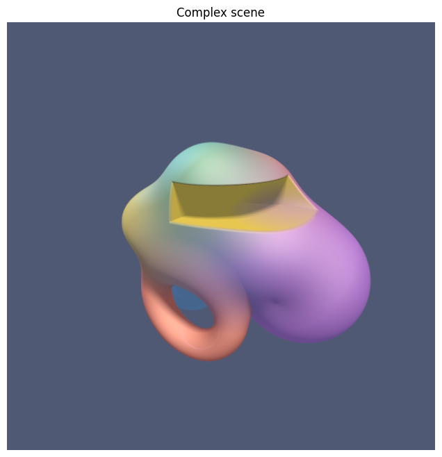

# jaxCAD

Differentiable SDF primitives, transformations, and constraint system built with JAX.

> [!WARNING]
> The API is not stable. Expect breaking changes.



---

## Features

- **SDF primitives** — sphere, box, capsule, cylinder, torus, and more
- **Boolean ops** — union, intersection, subtraction with smooth blending
- **Transforms** — translate, rotate, scale, mirror, repeat
- **Raymarcher** — sphere-tracing renderer with materials, lighting, refraction, and anti-aliasing
- **Differentiable rendering** — gradients flow through the full render pipeline via JAX
- **Constraint system** — geometric constraints (distance, angle, coincident) with Riemannian gradient descent and Newton projection onto the constraint manifold
- **JAX-native** — every scene is a pure function; `jit`, `grad`, and `vmap` work out of the box


---

## Development install

Clone this repo and
```bash
cd jaxcad
uv sync
pre-commit install
```

## Tests

```bash
pytest tests/
```

## Docs

Requires [Quarto](https://quarto.org/docs/get-started/) and the `docs` extras:

```bash
pip install -e ".[docs]"
quartodoc build   # generate API reference from docstrings
quarto preview    # serve locally at localhost:4321
```

---

Inspired by [Fidget](https://www.mattkeeter.com/projects/fidget/) and [Inigo Quilez's distance functions](https://iquilezles.org/articles/distfunctions/).

---



## License

[Elastic License 2.0](LICENSE) — free for personal, research, and internal business use. Offering jaxcad as a hosted or managed service requires a commercial license. Contact [andrin.rehmann@gmail.com](mailto:andrin.rehmann@gmail.com) for commercial enquiries.
