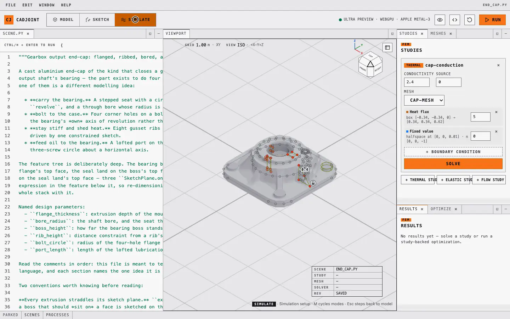
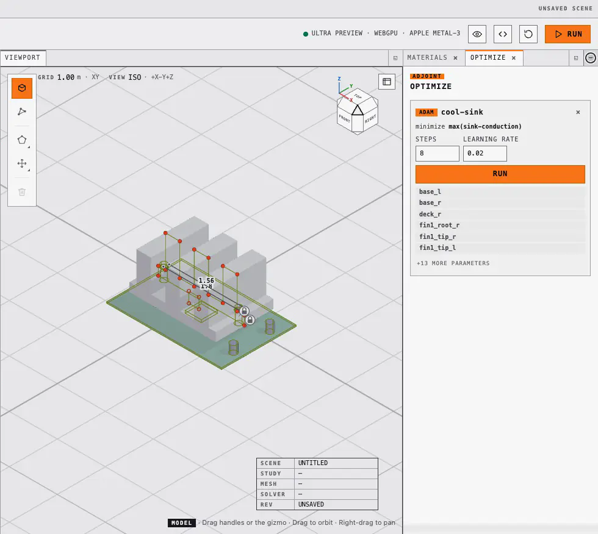

# cadjoint

Differentiable code-first CAD: sketches, constraints, SDF geometry, meshing and
FEM simulation composed into one function JAX can differentiate end to end.

> [!WARNING]
> The API is not stable. Expect breaking changes.

[![The bracket scene in the cadjoint playground: with the pointer in vertex selection, the tip of the bracket's triangular gusset rib is dragged up the vertical web. The rib re-attaches where the pointer puts it and the smooth union re-blends the joint at frame rate while the plate and web stay put; the editor on the left holds the highlighted line rib_tip = Vector2(value=[-0.9, -0.62], free=True, ...). Then the camera makes one full turn around the bracket.](docs/assets/motion/bracket-orbit-drag.webp)](https://andrinr.github.io/cadjoint/docs/viewer.html)

*The handle under the pointer is a named `Vector2` in `scene.py`, and the
joint it moves is a smooth union of three extrusions. Dragging it writes the
parameter buffer the shader already reads, so the blend follows at frame
rate; releasing it patches the literal in the source. The source is the
model.*

## The chain

One Python program declares the whole thing, and every arrow is a derivative
JAX can take:

```
sketch vertices ─► constraints ─► SDF ─► mesh ─► FEM solve ─► objective
       └─────────────────────────── ∂J/∂θ ◄───────────────────────────┘
```

A sketch profile is a list of named `Vector2` parameters. Constraints are
residuals on those parameters, solved by Newton projection onto the constraint
manifold. Extruding or revolving the profile produces an SDF that *shares* those
parameter objects. Dual contouring turns the field into a surface, TetGen or
Gmsh fills it, and jax-fem or CalculiX solves on it. A study is declared in the
scene beside the geometry it loads — here the end cap's `ThermalStudy`, a heat
flux on the bearing boss and a fixed temperature on the flange — and solving it
is one click, meshing included:

[](scenes/end_cap.py)

The same study is a function of the sketch, so `jax.grad` reaches from its
objective back to a fin's tip coordinate. An `Optimization` declared in the
scene descends on that gradient, every step a mesh, a solve and an adjoint,
projected back onto the constraints. The heat sink below starts deliberately
overbuilt and slims as its peak temperature falls:

[](scenes/starter.py)

A work plane taken from a face (`SketchPlane.on(body.cap("+"))`) is an
expression over the parent feature's parameters, so a boss extruded from it
differentiates with respect to its parent's depth. Every sketch's plane is
drawn in the viewport with its origin and normal; the sketch tool shows where
a new one will land before it exists, and a plane written as literals can be
taken by its frame and moved, which rewrites the `SketchPlane(origin=...)`
in the source:

[![The heat sink in the playground with every sketch plane drawn as a translucent frame, an origin cross and a normal glyph, each named. The sketch tool is armed and a ghost frame labelled new sketch follows the pointer across the floor. Then the fin comb's plane is selected by its frame edge, the gizmo appears at its origin, and dragging the gizmo's Z arrow lifts the whole comb; the editor's SketchPlane(origin=[...]) literal is rewritten on release.](docs/assets/motion/sketch-planes.webp)](scenes/starter.py)

No boundary representation is stored: the field is the model, and every
surface is derived from it at a resolution you choose.

## What ships

- **Geometry** — SDF primitives, smooth booleans, transforms, patterns;
  sketches on work planes extruded, revolved or lofted into solids that share
  their parameters; reference planes taken from faces, offsets and midplanes
- **Constraints** — distance, angle, coincident, horizontal, vertical,
  parallel, perpendicular, equal-length, point-on-line, fixed
- **Materials** — a sourced catalogue carrying density, conductivity, elastic
  constants and yield strength in SI, sampled per element by the solver
- **Meshing** — dual contouring with sharp-feature vertices; TET4/TET10 through
  TetGen, second-order tets through Gmsh, or a voxelize-and-snap HEX8 path;
  OBJ, STL and faceted STEP export
- **Simulation** — thermal and linear-elastic studies with programmatic node
  selections, solved by jax-fem or CalculiX 2.23; a lattice-Boltzmann flow
  prototype
- **Optimization** — declared in the scene, descended with optax, every step
  projected back onto the constraints
- **Plugins** — every non-JAX component (meshers, solvers) is a
  [Tesseract](https://github.com/pasteurlabs/tesseract-core) behind one
  `apply`/`vjp` interface, run in-process, in a container or remotely
- **Rendering** — a forward raymarcher in JAX, and a StableHLO → WGSL shader
  compiler for the browser
- **Playground** — a WebGPU app where every edit rewrites the Python source
  that produced it

## Install

```bash
git clone https://github.com/andrinr/cadjoint
cd cadjoint
uv sync                      # CPU JAX — macOS, Linux, Windows
uv sync --extra cuda         # Linux + NVIDIA GPU instead
```

Everything beyond the geometry core is an extra, one `--extra` per name:

| Extra | Pulls in |
| --- | --- |
| `fem` | jax-fem finite-element stack (basix, meshio, petsc4py, gmsh) |
| `tesseract` | tesseract-core + tesseract-jax, the plugin runtime |
| `gmsh` | Gmsh in-process for the tet10 mesher (GPL, hence its own extra) |
| `viewer` | Jupyter widget (`anywidget`) and the playground's process monitor (`psutil`) |
| `editor` | playground lint, completion and signature help (`ruff`, `jedi`) |
| `stepcheck` | OCCT validation of STEP exports (dev) |
| `docs` | Quarto API reference (`quartodoc`) |

Avoid `--all-extras` on macOS: `cuda` has no macOS wheels.

## The playground

```bash
uv run cadjoint-viewer --open      # serves http://127.0.0.1:8765/
```

The editor on the left holds `scene.py`; the viewport shows the compiled
field. Vertex handles, gizmos, material swatches, face picks, constraint chips
and solver runs all write back into the source. A properties window follows
the selection and shows every argument the call was written with: literals
as fields you can edit, expressions as the text they are.

[](scenes/starter.py)

Three desks, Model, Sketch and Simulate, share one viewport. Studies solve
with one click, results land in a labelled legend, and a declared
optimization streams step by step and writes its optimized values into the
program.

The server only listens on localhost and compiles each edit in a timed child
process, but it executes Python on your machine: only run code you trust.

The [playground guide](https://andrinr.github.io/cadjoint/docs/viewer.html)
walks through every window with recorded clips.

## In Python

```python
from cadjoint.construction import PolygonProfile, SketchPlane, extrude
from cadjoint.constraints import DistanceConstraint, satisfy_constraints
from cadjoint.geometry import Scalar, Vector2
from cadjoint.meshing import GridSpec, extract_mesh

a = Vector2([0.0, 0.0], free=True, name="a")
b = Vector2([1.0, 0.0], free=True, name="b")
c = Vector2([1.0, 1.0], free=True, name="c")
d = Vector2([0.0, 1.0], free=True, name="d")
DistanceConstraint(a, b, 1.2)

depth = Scalar(0.5, free=True, name="depth")
block = extrude(PolygonProfile([a, b, c, d], plane=SketchPlane()), depth=depth)
satisfy_constraints(block)          # projects a and b onto the constraint, in place

grid = GridSpec.from_bounds((-0.5, -0.5, -0.5), (2.0, 2.0, 1.5), 32)
mesh = extract_mesh(block, grid)
```

`functionalize(block)` returns a pure function of the free parameters, so
`jax.grad` of anything downstream reaches `a`, `b`, `c`, `d` and `depth`. The
[getting-started guide](https://andrinr.github.io/cadjoint/docs/getting-started.html)
continues from here to meshing, a thermal study and an optimization;
`examples/fem_bracket_optimization.py` runs the full chain from the command
line, with the adjoint checked against finite differences at every boundary.

## Documentation

- [Getting started](https://andrinr.github.io/cadjoint/docs/getting-started.html)
- [Differentiable meshing](https://andrinr.github.io/cadjoint/docs/meshing.html),
  [simulation](https://andrinr.github.io/cadjoint/docs/simulation.html),
  [optimization](https://andrinr.github.io/cadjoint/docs/optimization.html),
  [materials](https://andrinr.github.io/cadjoint/docs/materials.html)
- [Plugins](https://andrinr.github.io/cadjoint/docs/plugins.html): the Tesseract
  contract, the shipped packages, containers and remote transports
- [Rendering](https://andrinr.github.io/cadjoint/docs/rendering.html) and the
  [playground](https://andrinr.github.io/cadjoint/docs/viewer.html)
- [Research notes](research/README.md): design records for the meshing
  pipeline, FEM integration, the flow solver, the constraint system, and the
  measured [performance profile](research/performance.md)

## Developing

```bash
uv run pytest tests -q --ignore=tests/fem   # fast gate
uv run pytest tests/fem -q                  # needs the fem extra; CalculiX via CADJOINT_CCX
uv run pre-commit install                   # ruff on commit
```

The playground UI is a Solid + TypeScript app in `frontend/`, built into
`cadjoint/viewer/static` and committed, so installing cadjoint needs no Node
toolchain. `npm run dev` proxies to a running server, `npm run build` refreshes
the bundle, `npm test` and `npm run e2e` run the unit and Playwright suites.

Docs need [Quarto](https://quarto.org/docs/get-started/) and the `docs` extra:
`uv run quartodoc build` then `quarto preview`.

Performance work is measured, not guessed: `benchmarks/jax_compile_profile.py`
breaks a worker request into trace, lower, XLA compile and cache time per
program, and [`research/performance.md`](research/performance.md) records what
each lever bought.

## History

cadjoint was an entry in the
[Tesseract Hackathon 2026](https://si-tesseract.discourse.group) (Track 01,
inverse design and shape optimization). That state is frozen on the
[`tesseract-hackathon-2026`](https://github.com/andrinr/cadjoint/tree/tesseract-hackathon-2026)
branch. Inspired by [Fidget](https://www.mattkeeter.com/projects/fidget/) and
[Inigo Quilez's distance functions](https://iquilezles.org/articles/distfunctions/).

## License

[Apache License 2.0](LICENSE).
