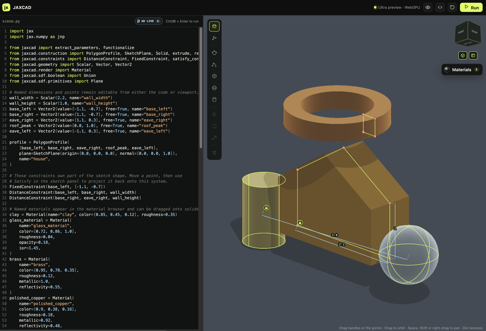
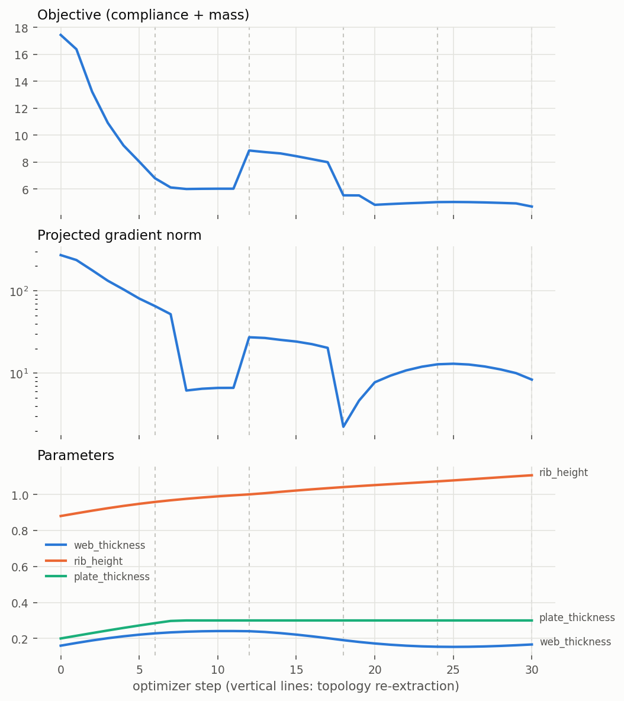

# cadjoint

Differentiable code-first CAD: sketches, constraints, SDF geometry, meshing, and
FEM simulation composed into one function JAX can differentiate end to end.

> [!WARNING]
> The API is not stable. Expect breaking changes.

[](https://andrinr.github.io/cadjoint/docs/viewer.html)

---

## Features

- **SDF primitives** — sphere, box, capsule, cylinder, torus, and more
- **Boolean ops** — union, intersection, subtraction with smooth blending
- **Transforms** — translate, rotate, scale, mirror, repeat
- **Forward raymarcher** — early-exit sphere tracing, reconstructed silhouettes, GGX materials, soft shadows, reflections, refraction, and anti-aliasing
- **Shader backends** — compile 3D SDFs through StableHLO to GLSL or WGSL
- **WebGPU viewers** — interactively inspect SDFs or progressively path-trace
  materials in the browser playground
- **Sketch construction** — 2D profiles on work planes, extruded or revolved into
  solids that share their parameters, so constraints and gradients act on both
- **Construction primitives** — boxes, spheres, and cylinders with editable
  placement, mirroring the SDF primitives they generate
- **Editable in the browser** — construction geometry renders as depth-tested
  overlays you can click, drag, place, and transform with a gizmo; every edit
  rewrites the Python source that produced it
- **Constraint system** — geometric constraints (distance, angle, coincident) with Riemannian gradient descent and Newton projection onto the constraint manifold
- **JAX-native** — every scene is a pure function; `jit`, `grad`, and `vmap` work out of the box


---

## Install

Clone the repo and sync with
[uv](https://docs.astral.sh/uv/getting-started/installation/):

```bash
git clone https://github.com/andrinr/cadjoint
cd cadjoint
uv venv                     # create .venv (--python 3.12 pins a version)
uv sync                     # CPU JAX — macOS, Linux, and Windows
# uv sync --extra cuda      # Linux + NVIDIA GPU
uv run pre-commit install   # optional: lint and format on commit
```

`uv sync` installs cadjoint into `.venv` in editable mode — creating the
environment first if you skipped `uv venv`. Run commands through it with
`uv run <cmd>`, or activate it once per shell:

```bash
source .venv/bin/activate       # Windows: .venv\Scripts\activate
```

The default sync pulls plain `jax`/`jaxlib`, so it works on Apple Silicon and any
CPU-only machine. CUDA wheels are Linux-only, so GPU support is opt-in through
the `cuda` extra.

Optional extras — repeat the flag, one `--extra` per name:

```bash
uv sync --extra viewer --extra fem --extra docs
```

| Extra | Pulls in |
| --- | --- |
| `cuda` | GPU JAX (Linux + NVIDIA only) |
| `viewer` | Jupyter widget (`anywidget`) |
| `fem` | jax-fem finite-element stack (basix, meshio, petsc4py) |
| `tesseract` | tesseract-core + tesseract-jax solver plugin runtime |
| `stepcheck` | OCCT kernel validation of STEP exports (dev) |
| `docs` | Quarto API reference (`quartodoc`) |

Avoid `--all-extras` on macOS — it includes `cuda`, which has no macOS wheels.

## Interactive browser playground

Start a local server for the split-pane Python editor and live WebGPU preview:

```bash
uv run cadjoint-viewer --open   # serves http://127.0.0.1:8765/ and opens your browser
```

Equivalent invocations and options (drop `uv run` inside an activated `.venv`):

```bash
uv run python -m cadjoint.viewer.playground   # same server, no browser launch
uv run cadjoint-viewer --port 9000            # pick a different port
uv run cadjoint-viewer --help                 # list all flags
```

Then open <http://127.0.0.1:8765/> if you did not pass `--open`. No extra
dependencies are needed — the server is stdlib-only — but the preview needs a
WebGPU-capable browser (recent Chrome, Edge, or Safari). Stop the server with
`Ctrl+C`.

Edit the example on the left and run it with `Ctrl+Enter` (or `Cmd+Enter`). The
program must assign its final SDF to `scene`. Use **Path trace** for progressive
multi-bounce lighting, GGX reflections, and glass transport; camera and scene
changes reset accumulation automatically. The server only listens on localhost
and compiles each edit in a timed child process, but the editor still executes
Python on your machine—only run code you trust.

### Modelling in the viewer

Construction geometry — sketch profiles and primitives — is drawn over the
rendered solid as a depth-tested wireframe (an edge behind the model is hidden
by it) and can be edited directly:

| Action | Result |
| --- | --- |
| Click a vertex handle | Selects it and highlights the exact literal in the code |
| Drag a handle | Rewrites that vertex's coordinates and rebuilds the solid |
| **Polygon**, then click edges | Inserts a vertex per click until Esc |
| Select a handle, press Delete | Removes that vertex |
| **Box** / **Sphere** / **Cylinder**, then click | Writes a `Solid.*` call and adds it to the scene |
| Click a solid's outline | Selects it and shows the move/rotate gizmo |
| Drag a gizmo arrow or ring | Rewrites `position=` or `rotation=` on that solid |
| Drag empty space / Shift-drag / scroll | Orbit / pan / zoom |

Every edit is applied to the Python source, which stays the single source of
truth — there is no hidden scene state to drift out of sync. Geometry whose
literals cannot be rewritten (built in a loop, or from a variable) still
renders, but is read-only in the viewer.

Solids created this way come from the construction layer, so they are ordinary
parametric geometry as well as viewer objects:

```python
from cadjoint.construction import Solid
from cadjoint.sdf.boolean import Union

scene = Union(
    Solid.box(size=[1, 1, 0.5], position=[0, 0, 0], rotation=[0, 0, 0.4]),
    Solid.sphere(radius=0.6, position=[1.5, 0, 0]),
)
```

`size`, `position`, and `rotation` become named free parameters shared with the
SDF the factory returns, so constraints and `jax.grad` reach them exactly as
they do for sketch vertices. `size` is half-extents and `rotation` is intrinsic
X, Y, Z angles in radians, matching the underlying primitives.

### Developing the playground UI

The UI is a Solid + TypeScript app in `frontend/`, built into
`cadjoint/viewer/static` and committed, so installing cadjoint needs no Node
toolchain. To work on it:

```bash
cd frontend
npm install
npm run dev        # Vite on :5173, proxying the API to the Python server
npm run build      # refresh cadjoint/viewer/static (commit the result)
npm test           # projection and picking unit tests
npm run e2e        # Playwright, drives the real server end to end
```

Run `uv run cadjoint-viewer` alongside `npm run dev` so the dev server has an API
to proxy to.

## Shader compilation and live viewer

Compile an SDF to a standalone shader function:

```python
from cadjoint.backends import compile_sdf_to_wgsl, compile_scene_to_wgsl
from cadjoint.sdf.primitives import Sphere

sphere = Sphere(radius=1.0)
wgsl = compile_sdf_to_wgsl(sphere)
wgsl_scene = compile_scene_to_wgsl(sphere)
```

`compile_scene_to_wgsl` emits `sdf`, `material_base` (RGB + roughness), and
`material_optics` (metallic + opacity + IOR + reflectivity) from the same scene
snapshot, ready to embed in a WebGPU renderer.

The Jupyter viewer is an optional dependency:

```bash
uv sync --extra viewer
```

```python
from cadjoint.viewer import SDFViewer

SDFViewer(sphere)
```

See the [rendering notebook](examples/rendering.ipynb) for composition and
hot-reload examples.

For a split-pane Python editor and live WebGPU preview in the browser, see
[Interactive browser playground](#interactive-browser-playground) above.

The [WebGPU viewer guide](https://andrinr.github.io/cadjoint/docs/viewer.html) includes
a live interactive scene and covers the local playground, camera controls,
generated shader inspection, and the Jupyter widget.

For offscreen OpenGL rendering, install the `glsl` extra instead.

## Forward rendering

The image renderer groups scene data and quality controls explicitly:

```python
from cadjoint.render import Camera, RenderSettings, Scene, render_scene
from cadjoint.sdf.primitives import Sphere

scene = Scene(
    Sphere(1.0),
    camera=Camera(position=(0, 1.5, 5), target=(0, 0, 0)),
)
image = render_scene(scene, RenderSettings.balanced((240, 320)))
```

Use `RenderSettings.draft()`, `.balanced()`, or `.high_quality()` to choose an
explicit performance/fidelity trade-off. See the [forward renderer guide](https://andrinr.github.io/cadjoint/docs/rendering.html)
for mode and quality comparisons.

## End-to-end optimization

The pipeline is differentiable from the first named dimension to the last
solver residual, and `examples/fem_bracket_optimization.py` walks the whole
chain on the parametric L-bracket from `scenes/bracket.py`:

**named CAD parameters** (`web_thickness`, `rib_height`, `plate_thickness`)
→ **bracket SDF** → **HEX8 mesh** (frozen topology, node positions recomputed
differentiably per candidate) → **linear elastic solve** (jax-fem adjoint, or
CalculiX's native `*SENSITIVITY` via `--backend calculix`) → **compliance +
mass objective** → **optax Adam** with box-bound projection.

Meshing splits into a discrete half (which cells are inside, how they connect)
and a continuous half (where the nodes sit). The discrete half cannot be
differentiated, so topology stays frozen while gradients flow through the node
positions, and every few steps the mesh is re-extracted at the current design —
the small objective jumps at those steps are the discretization being refreshed.

```bash
uv pip install optax                              # optimizer (one-off)
uv run python examples/fem_bracket_optimization.py            # ~10 min, CPU
uv run python examples/fem_bracket_optimization.py --smoke    # 2 cheap steps
```

Requires the `fem` extra (`uv sync --extra fem`). The run validates the adjoint
gradient against finite differences, descends for 30 steps, prints a summary
table, and writes convergence CSV + figure and before/after VTK files to
`examples/output/`:



## Tesseracts: one differentiable function across four AD strategies

Real engineering pipelines die at tool boundaries — a Fortran solver here, a
Rust kernel there, a mesher nobody can differentiate — and the gradients die
with them. cadjoint crosses those boundaries with
[Tesseract](https://github.com/pasteurlabs/tesseract-core): every non-JAX
component is packaged as a Tesseract exposing typed `apply` and
`vector_jacobian_product` endpoints, and
[tesseract-jax](https://github.com/pasteurlabs/tesseract-jax) lifts each one
into a JAX primitive. The result is a single function from CAD parameters to
engineering objective that `jax.grad` differentiates end to end, even though
no two stages agree on how to compute a derivative.

### The Tesseracts in this repo

| Tesseract | Wraps | Boundary crossed | How its VJP works |
| --- | --- | --- | --- |
| `cadjoint/fem/tesseracts/thermal_jaxfem` | jax-fem Poisson solve | AD strategy: JAX cannot trace the solver (PETSc assembly) | Implicit adjoint — one transposed linear solve per cotangent |
| `cadjoint/fem/tesseracts/elastic_jaxfem` | jax-fem linear elasticity + von Mises | same | same; gradients bit-identical to the in-process path |
| `cadjoint/fem/tesseracts/elastic_calculix` | **CalculiX 2.23, Fortran**, over a subprocess (text decks in, result files out) | Language, licence (GPL-2 isolated), and AD strategy | The solver's native `*SENSITIVITY` discrete adjoint, plus a correction we derived for a missing Jacobian-variation term in ccx 2.23 — validated to 2e-4 of finite differences |
| `native/tesseract_api.py` | **Rust** dual-contouring kernels (batched QEF solves, rayon-parallel, 90–107× faster than the reference) | Language and memory model (cdylib over ctypes) | Hand-derived linear-solve VJP, matches JAX autodiff to ~4e-14 |
| `cadjoint/fem/tesseracts/mesher` *(experimental, in validation)* | The **whole black-box mesher** — dual-contoured surface into a tetrahedral volume mesher whose internals nobody differentiates | The boundary everyone gives up on: a discrete, non-differentiable meshing algorithm | **Surface-interpolation VJP**: a boundary vertex lies on the zero set of the trilinearly interpolated SDF samples, so the implicit function theorem gives `∂v/∂fᵢ = −wᵢ(v)·∇f/|∇f|²` — the interpolation weights at the frozen vertex locations *are* the VJP rows. Any mesher becomes differentiable without touching its internals; only the Hadamard-meaningful normal motion is carried |

### The composition

```
CAD parameters θ  ──►  constraints ──► SDF        (JAX autodiff)
        │                              │
        │                              ▼
        │                    lattice SDF samples   (JAX autodiff)
        │                              │
        │                              ▼
        │              ┌─ mesher Tesseract ──────┐ (frozen topology;
        │              │  DC surface → tet/hex   │  interpolation VJP)
        │              └───────────┬─────────────┘
        │                          ▼
        │              ┌─ solver Tesseract ──────┐ (jax-fem adjoint, or
        │              │  thermal / elastic FEM  │  CalculiX Fortran adjoint)
        │              └───────────┬─────────────┘
        │                          ▼
        └──────────  ∂J/∂θ  ◄──  objective J      (JAX autodiff)
```

`examples/fem_bracket_optimization.py` runs this loop for real: optax Adam over
named CAD parameters, objective down 73% in 30 steps, adjoint checked against
finite differences at every boundary (2e-5 … 3e-7 per parameter), and
`--backend calculix` swaps a 1990s Fortran code into the same `jax.grad` call
without changing a line of the objective.

### Why Tesseract is load-bearing here

- **CalculiX cannot be traced, linked, or relicensed** — it is GPL-2 Fortran
  speaking input decks. The Tesseract boundary is what lets its native adjoint
  compose with JAX autodiff while staying a subprocess.
- **The mesher VJP is a contract, not a computation** — the surface-
  interpolation map is defined at the Tesseract boundary from the *inputs and
  outputs alone*, which is what makes swapping TetGen, fTetWild, or gmsh
  behind it a zero-cost experiment.
- **Solvers are plugins.** `SolverBackend` routes `backend="jaxfem" | "tesseract"
  | "calculix"` through one ABI; the survey in
  `research/simulator-ecosystem.md` ranks 31 further candidates (jwave,
  JAX-Fluids, MJX, …) that drop into the same slot.
- **It stays fast.** Tesseracts here run in-process via
  `Tesseract.from_tesseract_api` — no Docker, ~0.14 s per apply/VJP roundtrip —
  with containerization available when a component needs isolation.

Design notes: `research/fem-integration.md` (solver ABI, adjoint mechanics,
the ccx sensitivity correction), `research/native-mesher.md` (Rust core and
its VJP), `research/tet-vs-hex.md` (the mesher-Tesseract validation matrix).

## Tesseract Hackathon 2026 entry

cadjoint is an entry in the [Tesseract Hackathon 2026](https://si-tesseract.discourse.group)
(**Track 01 — Inverse design & shape optimization**). The entry state is
frozen on the branch
[`tesseract-hackathon-2026`](https://github.com/andrinr/cadjoint/tree/tesseract-hackathon-2026),
which is kept permanently; development continues on `main`.

**The headline workflow** is the two-Tesseract differentiable chain built on
a surface-interpolation VJP:

```
CAD params θ ──► SDF lattice samples ──► ┌ mesher Tesseract ┐ ──► ┌ solver Tesseract ┐ ──► J
   (JAX)              (JAX)              │  black-box mesh  │      │  FEM adjoint     │
                                         └──────────────────┘      └──────────────────┘
                     ∂J/∂θ  ◄──  one jax.grad call through both boundaries
```

The mesher Tesseract wraps a *non-differentiable* meshing pipeline (dual-
contoured surface → TetGen / hex voxelization). Its VJP never looks inside
the mesher: a boundary vertex `v` lies on the zero set of the trilinearly
interpolated lattice samples, so the implicit function theorem gives
`∂v/∂fᵢ = −wᵢ(v)·∇f/|∇f|²` — **the interpolation weights at the frozen
vertex locations are the VJP rows**, making any mesher differentiable from
its inputs and outputs alone. Composed with the unmodified jax-fem solver
Tesseract, one `jax.grad` call crosses both boundaries: the VJP matches
autodiff of the same map to 1.4e-11, finite differences confirm the smooth
parameters, and five gradient steps drop the bracket objective 36%, with
the Tesseract's frozen-topology promise detecting when a step demands
re-meshing. Validation matrix: `research/tet-vs-hex.md`; runnable demo:
`tests/fem/test_tetmesh.py::TestTwoTesseractChain` (with `-s`).

Provenance: the geometry foundation (SDF kernel, constraints, viewer shell)
predates the hackathon; every contribution above — the meshing pipeline,
all Tesseracts, the CalculiX adjoint correction, the mesher VJP, and the
end-to-end optimization — was written during the hackathon window
(Aug 3–31, 2026), verifiable commit-by-commit on the frozen branch. Whole
repo under Apache 2.0.

## Tests

```bash
uv run pytest tests/
```

## Docs

Requires [Quarto](https://quarto.org/docs/get-started/) and the `docs` extras:

```bash
uv sync --extra docs
uv run quartodoc build   # generate API reference from docstrings
quarto preview           # serve locally at localhost:4321
```

---

Inspired by [Fidget](https://www.mattkeeter.com/projects/fidget/) and [Inigo Quilez's distance functions](https://iquilezles.org/articles/distfunctions/).

---


## License

[Apache License 2.0](LICENSE).
