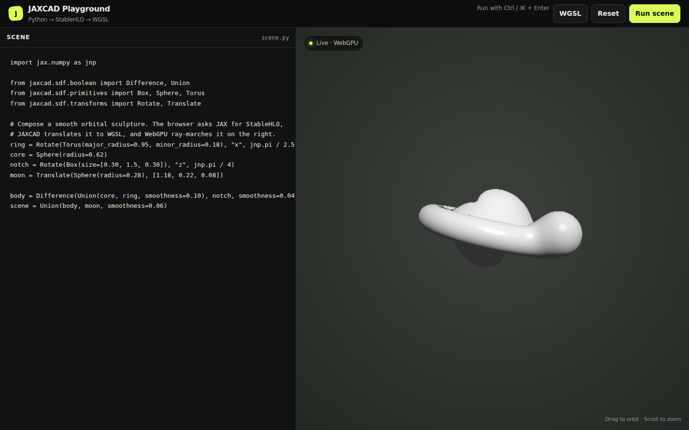

# jaxCAD

Differentiable SDF primitives, transformations, and constraint system built with JAX.

> [!WARNING]
> The API is not stable. Expect breaking changes.

[](https://andrinr.github.io/jaxcad/docs/viewer.html)

---

## Features

- **SDF primitives** — sphere, box, capsule, cylinder, torus, and more
- **Boolean ops** — union, intersection, subtraction with smooth blending
- **Transforms** — translate, rotate, scale, mirror, repeat
- **Forward raymarcher** — early-exit sphere tracing, reconstructed silhouettes, GGX materials, soft shadows, reflections, refraction, and anti-aliasing
- **Shader backends** — compile 3D SDFs through StableHLO to GLSL or WGSL
- **WebGPU viewers** — interactively inspect SDFs or progressively path-trace
  materials in the browser playground
- **Constraint system** — geometric constraints (distance, angle, coincident) with Riemannian gradient descent and Newton projection onto the constraint manifold
- **JAX-native** — every scene is a pure function; `jit`, `grad`, and `vmap` work out of the box


---

## Shader compilation and live viewer

Compile an SDF to a standalone shader function:

```python
from jaxcad.backends import GLSLBackend, WGSLBackend
from jaxcad.backends.wgsl import compile_scene_to_wgsl
from jaxcad.sdf.primitives import Sphere

sphere = Sphere(radius=1.0)
glsl = GLSLBackend().compile_sdf(sphere)
wgsl = WGSLBackend().compile_sdf(sphere)
wgsl_scene = compile_scene_to_wgsl(sphere)
```

`compile_scene_to_wgsl` emits `sdf`, `material_base` (RGB + roughness), and
`material_optics` (metallic + opacity + IOR + reflectivity) from the same scene
snapshot, ready to embed in a WebGPU renderer.

The Jupyter viewer is an optional dependency:

```bash
pip install -e ".[viewer]"
```

```python
from jaxcad.viewer import SDFViewer

SDFViewer(sphere)
```

See the [WebGPU viewer notebook](examples/webgpu_viewer.ipynb) for composition and
hot-reload examples.

For a split-pane Python editor and live WebGPU preview, start the local playground:

```bash
jaxcad-viewer --open
# or: python -m jaxcad.viewer.playground --open
```

Edit the example on the left and run it with `Ctrl+Enter` (or `Cmd+Enter`). The
program must assign its final SDF to `scene`. Use **Path trace** for progressive
multi-bounce lighting, GGX reflections, and glass transport; camera and scene
changes reset accumulation automatically. The server only listens on localhost
and compiles each edit in a timed child process, but the editor still executes
Python on your machine—only run code you trust.

The [WebGPU viewer guide](https://andrinr.github.io/jaxcad/docs/viewer.html) includes
a live interactive scene and covers the local playground, camera controls,
generated shader inspection, and the Jupyter widget.

For offscreen OpenGL rendering, install the `glsl` extra instead.

## Forward rendering

The image renderer groups scene data and quality controls explicitly:

```python
from jaxcad.render import Camera, RenderSettings, Scene, render_scene
from jaxcad.sdf.primitives import Sphere

scene = Scene(
    Sphere(1.0),
    camera=Camera(position=(0, 1.5, 5), target=(0, 0, 0)),
)
image = render_scene(scene, RenderSettings.balanced((240, 320)))
```

Use `RenderSettings.draft()`, `.balanced()`, or `.high_quality()` to choose an
explicit performance/fidelity trade-off. See the [forward renderer guide](https://andrinr.github.io/jaxcad/docs/rendering.html)
for mode and quality comparisons.

## Development install

Clone this repo and
```bash
cd jaxcad
uv sync
pre-commit install
```

## Tests

```bash
pytest tests/
```

## Docs

Requires [Quarto](https://quarto.org/docs/get-started/) and the `docs` extras:

```bash
pip install -e ".[docs]"
quartodoc build   # generate API reference from docstrings
quarto preview    # serve locally at localhost:4321
```

---

Inspired by [Fidget](https://www.mattkeeter.com/projects/fidget/) and [Inigo Quilez's distance functions](https://iquilezles.org/articles/distfunctions/).

---


## License

[Elastic License 2.0](LICENSE) — free for personal, research, and internal business use. Offering jaxcad as a hosted or managed service requires a commercial license. Contact [andrin.rehmann@gmail.com](mailto:andrin.rehmann@gmail.com) for commercial enquiries.
