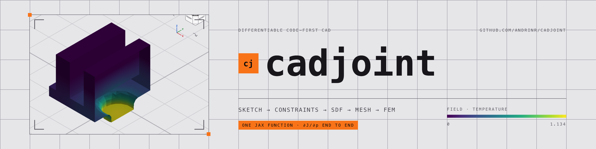
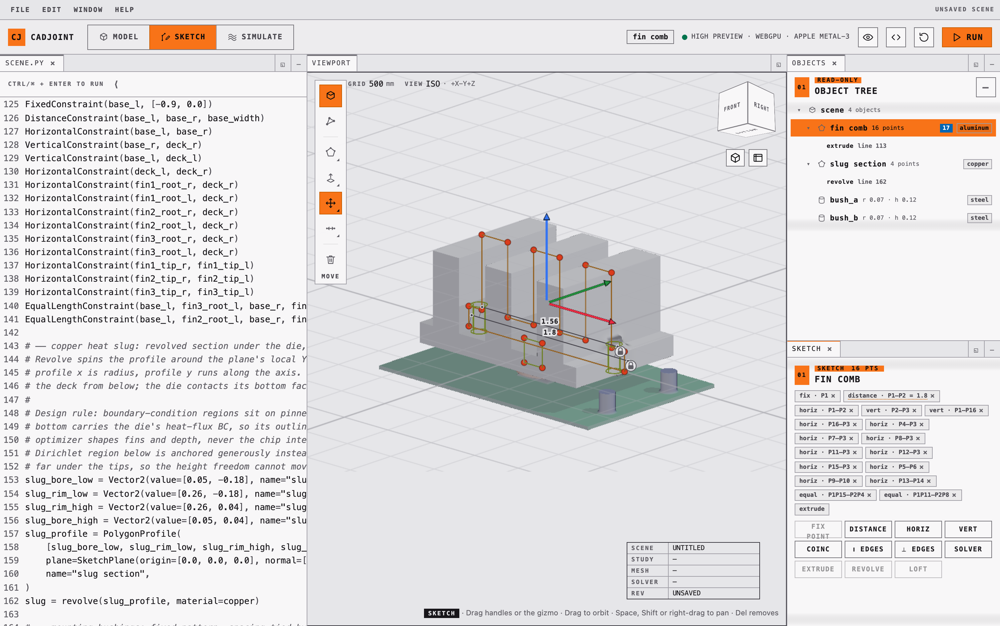
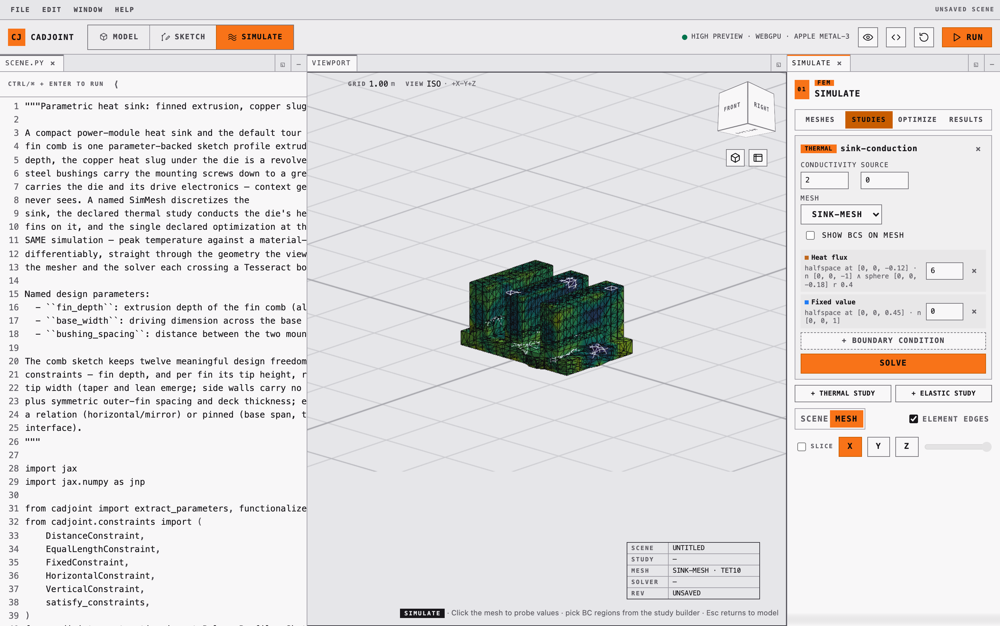

<picture>
  <source media="(prefers-color-scheme: dark)" srcset="docs/assets/banner-readme-dark.png">
  
</picture>

# cadjoint

Differentiable code-first CAD: sketches, constraints, SDF geometry, meshing, and
FEM simulation composed into one function JAX can differentiate end to end.

> [!WARNING]
> The API is not stable. Expect breaking changes.

[](https://andrinr.github.io/cadjoint/docs/viewer.html)

---

## The chain

One Python program declares the whole thing, and every arrow below is a
derivative JAX can take:

```
sketch vertices ─► constraints ─► SDF ─► mesh ─► FEM solve ─► objective
       └─────────────────────────── ∂J/∂θ ◄───────────────────────────┘
```

A sketch profile is a list of named `Vector2` parameters. Constraints are
residuals on those parameters, solved by Riemannian gradient descent and Newton
projection onto the constraint manifold. Extruding or revolving the profile
produces an SDF that *shares* those parameter objects, so the solid and the
sketch are the same variables. Dual contouring turns the field into a surface,
TetGen fills it, jax-fem or CalculiX solves on it — and `jax.grad` reaches from
the objective all the way back to a fin's tip coordinate.

Nothing in that chain is a snapshot. A work plane taken from a face
(`SketchPlane.on(body.cap("+"))`) is an *expression* over the parent feature's
parameters, so the volume of a boss extruded from it differentiates with respect
to its parent's depth — the thing a B-rep modeller cannot do, because there a
face is stored geometry rather than a function of the feature that made it
(`tests/construction/test_reference_planes.py`).

---

## Features

- **SDF primitives** — sphere, box, capsule, cylinder, torus, and more
- **Boolean ops** — union, intersection, subtraction with smooth blending
- **Transforms** — translate, rotate, scale, mirror, repeat
- **Sketch construction** — 2D profiles on work planes, extruded, revolved or
  lofted into solids that share their parameters, so constraints and gradients
  act on both
- **Reference geometry** — sketch planes taken from a feature's own faces
  (`solid.cap("+")`, `solid.side(i)`, `block.face("+x")`), offset planes, and
  tangent planes Newton-projected onto a field, all differentiable through the
  parent
- **Constraint system** — distance, angle, coincident, horizontal, vertical,
  parallel, perpendicular, equal-length, point-on-line and fixed (plus the
  edge-pair forms), solved by Riemannian gradient descent and Newton projection
  onto the constraint manifold
- **Meshing** — dual contouring with sharp-feature QEF vertices (Rust core),
  TetGen fill to TET4/TET10, or a deterministic voxelize-and-snap HEX8 path
- **FEM** — thermal and linear-elastic studies with programmatic node selections,
  solved by jax-fem or by CalculiX 2.23 over a subprocess
- **Optimization** — declared in the scene, descended with optax, every step
  projected back onto the sketch constraints
- **Forward raymarcher** — early-exit sphere tracing, reconstructed silhouettes,
  GGX materials, soft shadows, reflections, refraction, anti-aliasing
- **Shader backend** — compile 3D SDFs through StableHLO to WGSL
- **Browser playground** — a docked, windowed WebGPU app where every edit
  rewrites the Python source that produced it
- **JAX-native** — every scene is a pure function; `jit`, `grad`, and `vmap` work
  out of the box

---

## Install

Clone the repo and sync with
[uv](https://docs.astral.sh/uv/getting-started/installation/):

```bash
git clone https://github.com/andrinr/cadjoint
cd cadjoint
uv venv                     # create .venv (--python 3.12 pins a version)
uv sync                     # CPU JAX — macOS, Linux, and Windows
# uv sync --extra cuda      # Linux + NVIDIA GPU
uv run pre-commit install   # optional: lint and format on commit
```

`uv sync` installs cadjoint into `.venv` in editable mode — creating the
environment first if you skipped `uv venv`. Run commands through it with
`uv run <cmd>`, or activate it once per shell:

```bash
source .venv/bin/activate       # Windows: .venv\Scripts\activate
```

The default sync pulls plain `jax`/`jaxlib`, so it works on Apple Silicon and any
CPU-only machine. CUDA wheels are Linux-only, so GPU support is opt-in through
the `cuda` extra.

Optional extras — repeat the flag, one `--extra` per name:

```bash
uv sync --extra viewer --extra fem --extra editor --extra docs
```

| Extra | Pulls in |
| --- | --- |
| `cuda` | GPU JAX (Linux + NVIDIA only) |
| `viewer` | Jupyter widget (`anywidget`) |
| `editor` | playground editor intelligence (`jedi`, `ruff`) |
| `fem` | jax-fem finite-element stack (basix, meshio, petsc4py) |
| `tesseract` | tesseract-core + tesseract-jax solver plugin runtime |
| `stepcheck` | OCCT kernel validation of STEP exports (dev) |
| `docs` | Quarto API reference (`quartodoc`) |

Avoid `--all-extras` on macOS — it includes `cuda`, which has no macOS wheels.

---

## The playground

```bash
uv run cadjoint-viewer --open   # serves http://127.0.0.1:8765/ and opens your browser
```

Equivalent invocations and options (drop `uv run` inside an activated `.venv`):

```bash
uv run python -m cadjoint.viewer.playground   # same server, no browser launch
uv run cadjoint-viewer --port 9000            # pick a different port
uv run cadjoint-viewer --help                 # list all flags
```

Then open <http://127.0.0.1:8765/> if you did not pass `--open`. No extra
dependencies are needed — the server is stdlib-only — but the preview needs a
WebGPU-capable browser (recent Chrome, Edge, or Safari). Stop the server with
`Ctrl+C`.

Edit the program on the left and run it with `Ctrl+Enter` (or `Cmd+Enter`). It
must assign its final SDF to `scene`. The server only listens on localhost and
compiles each edit in a timed child process, but the editor still executes
Python on your machine — only run code you trust.

### Panels are windows

Every panel is a dockview window: drag its tab to split or stack, minimise it to
a tray, float it out over the desk, close it and bring it back from the **Window**
menu. The viewport is the one exception — it is furniture and has no close
control. Arrangements survive a reload, and each mode remembers its own desk, so
switching to Simulate and back restores what you left in Model.


*Objects floated out of the grid and left hovering over the viewport, with
Materials and Optimize sharing one tab strip on the right. The WebGPU canvas is
re-parented, not rebuilt, so the context survives every drag, dock and mode
change (`frontend/e2e/windows.spec.ts`).*

Three modes seed those defaults — **Model**, **Sketch**, **Simulate** — cycled
with `M` (`Shift+M` backwards, `Esc` returns to Model). Selecting a sketch in the
viewport enters Sketch mode on its own; the two side columns keep the same widths
in all three modes so a mode change never moves the model out from under the
pointer.

### The viewport

The chrome and the viewport are the same sheet of paper: the seam between them is
a rule, not a step in luminance. Inside the rectangle nothing is coloured, so the
only hue there is a measurement — the viridis field ramp, the magma quality ramp,
the boundary-condition hues.

- a **world-space floor grid** at z = 0, Z-up, with the spacing of the ruling
  printed as a scale readout that follows the zoom (`GRID 1.00 m`, `GRID 500 mm`),
  so the view is calibrated rather than decorative
- a **title block** in the corner naming the scene, study, mesh, solver and
  revision — the state you would otherwise hunt through panels for
- a **construction overlay** — sketch profiles, vertex handles, constraint
  dimensions and gizmos, depth-tested against the solid (an edge behind the model
  is hidden by it) — toggled from
  **Display options → Customize → Construction overlay**
- **render presets** behind the same button: x-ray, studio, editor, with shading,
  shadow and quality controls, and **path tracing** for progressive multi-bounce
  lighting, GGX reflections and glass transport — camera and scene changes reset
  the accumulation automatically


*Overlay off. The graticule stays — it is furniture, held deliberately below the
contrast a meaningful mark owes (`frontend/test/graticule.test.ts`).*

### Model mode: direct editing that rewrites the source

Construction geometry is editable in place, and every edit is applied to the
Python program, which stays the single source of truth — there is no hidden scene
state to drift out of sync.

| Action | Result |
| --- | --- |
| Click a vertex handle | Selects it and highlights the exact literal in the code |
| Drag a handle | Rewrites that vertex's coordinates and rebuilds the solid |
| **P**, then click edges | Inserts a vertex per click until Esc |
| Select a handle, press Delete | Removes that vertex |
| **B** / **S** / **C**, then click | Writes a `Solid.*` call and adds it to the scene |
| Click a solid's outline | Selects it and shows the move/rotate gizmo (**G** / **R**) |
| Drag a gizmo arrow or ring | Rewrites `position=` or `rotation=` on that solid |
| Drag a material swatch onto a solid | Rewrites its `material=` argument |
| Drag empty space / Shift-drag / scroll | Orbit / pan / zoom |

Geometry whose literals cannot be rewritten (built in a loop, or from a variable)
still renders, but is read-only in the viewer.

Solids created this way come from the construction layer, so they are ordinary
parametric geometry as well as viewer objects:

```python
from cadjoint.construction import Solid
from cadjoint.sdf.boolean import Union

scene = Union(
    Solid.box(size=[1, 1, 0.5], position=[0, 0, 0], rotation=[0, 0, 0.4]),
    Solid.sphere(radius=0.6, position=[1.5, 0, 0]),
)
```

`size`, `position`, and `rotation` become named free parameters shared with the
SDF the factory returns, so constraints and `jax.grad` reach them exactly as they
do for sketch vertices. `size` is half-extents and `rotation` is intrinsic X, Y, Z
angles in radians, matching the underlying primitives.

### Sketch mode: constraints on the geometry they hold



*The starter's fin comb, 16 points under 17 constraints. Numeric distances draw
as dimensions in the viewport; relational constraints (horizontal, vertical,
equal-length) are chips in the Sketch window. Fix a point, dimension a pair, or
solve the system from the same panel — each writes the constraint back into
`scene.py`.*

The solver is exposed, not hidden: pick the method and iteration count, run it,
and the loss curve is drawn beside the chips. `satisfy_constraints(...)` appears
in the source with the settings you chose.

### Sketching on a face

A work plane can be taken from a feature's own face rather than typed as a
coordinate frame:

```python
body = extrude(profile, depth=fin_depth)
boss = PolygonProfile(SQUARE, plane=SketchPlane.on(body.cap("+")))
```

`body.cap("+")` / `body.cap("-")` are the ends of a sweep, `body.side(i)` the
wall swept by profile edge `i`, and `block.face("+x")` a primitive's face.
`SketchPlane.offset(reference, distance)` pushes a plane along its normal (the
distance may itself be a `Scalar` design variable), and `SketchPlane.tangent(...)`
Newton-projects onto a field for everything with no analytic face — blends,
fillets, the curved wall of a revolve. Picking a face in the viewport issues a
`set_sketch_plane` patch, which rewrites the plane argument in place.

### Simulate mode


*Simulate → Meshes. The declared `SimMesh` inspected in place: 5 726 nodes,
2 957 TET10 elements, aspect ratio 1.175 / 2.017 / 3.766 min/mean/max, with the
quality histogram under it. Resolution, bounds, domain and method are editable —
each edit is a patch back into `scene.py`.*



*Simulate → Studies. Boundary conditions are programmatic node selections
(`Nodes.halfspace(...) & Nodes.sphere(...)`), listed with the region they resolve
to. Add one by picking a region in the viewport; the study is rewritten in the
source.*


*Simulate → Results. The solved temperature field on the same mesh, sliced so the
flux entering at the die interface reads. The legend is a labelled bar: a ramp
with no numbers beside it is decoration.*

### Editor intelligence

The playground server exposes `POST /api/lint`, `/api/complete` and
`/api/signature` (`cadjoint/viewer/_intelligence.py`). Lint shells out to `ruff`;
completion and signature help drive `jedi` in-process against the environment the
server itself runs in, so completions know the real signatures of
`extrude`, `SketchPlane.on`, `ThermalStudy` and everything else in `cadjoint`.
Both dependencies are optional — install them with `--extra editor`; without
them, the endpoints answer with an install hint and the editor simply goes quiet.

### Developing the playground UI

The UI is a Solid + TypeScript app in `frontend/`, built into
`cadjoint/viewer/static` and committed, so installing cadjoint needs no Node
toolchain. To work on it:

```bash
cd frontend
npm install
npm run dev        # Vite on :5173, proxying the API to the Python server
npm run build      # refresh cadjoint/viewer/static (commit the result)
npm test           # 25 unit suites: projection, picking, tokens, graticule, windows
npm run e2e        # Playwright, drives the real server end to end
```

Run `uv run cadjoint-viewer` alongside `npm run dev` so the dev server has an API
to proxy to. The design system is specified in
[`research/design-language.md`](research/design-language.md), and
`frontend/src/tokens.ts` is its source of truth —
`frontend/test/tokens.test.ts` asserts the CSS cannot drift from it.

---

## Shader compilation and the Jupyter viewer

Compile an SDF to a standalone shader function:

```python
from cadjoint.backends import compile_sdf_to_wgsl, compile_scene_to_wgsl
from cadjoint.sdf.primitives import Sphere

sphere = Sphere(radius=1.0)
wgsl = compile_sdf_to_wgsl(sphere)
wgsl_scene = compile_scene_to_wgsl(sphere)
```

`compile_scene_to_wgsl` emits `sdf`, `material_base` (RGB + roughness), and
`material_optics` (metallic + opacity + IOR + reflectivity) from the same scene
snapshot, ready to embed in a WebGPU renderer.

The Jupyter viewer is an optional dependency:

```bash
uv sync --extra viewer
```

```python
from cadjoint.viewer import SDFViewer

SDFViewer(sphere)
```

See the [rendering notebook](examples/rendering.ipynb) for composition and
hot-reload examples, and the
[WebGPU viewer guide](https://andrinr.github.io/cadjoint/docs/viewer.html) for a
live interactive scene, camera controls, generated-shader inspection and the
widget.

## Forward rendering

The image renderer groups scene data and quality controls explicitly:

```python
from cadjoint.render import Camera, RenderSettings, Scene, render_scene
from cadjoint.sdf.primitives import Sphere

scene = Scene(
    Sphere(1.0),
    camera=Camera(position=(0, 1.5, 5), target=(0, 0, 0)),
)
image = render_scene(scene, RenderSettings.balanced((240, 320)))
```

Use `RenderSettings.draft()`, `.balanced()`, or `.high_quality()` to choose an
explicit performance/fidelity trade-off. See the
[forward renderer guide](https://andrinr.github.io/cadjoint/docs/rendering.html)
for mode and quality comparisons.

---

## The worked example: `scenes/starter.py`

The scene the playground opens with is a parametric power-module heat sink, and
it exercises the whole chain in one file:

- a **fin comb** — one `PolygonProfile` of 16 named `Vector2` points, extruded
  through a named `fin_depth`, held by 17 constraints that still leave twelve
  real design freedoms
- a **copper slug** revolved from a four-point section, and two steel bushings
  whose spacing is a `DistanceConstraint`, blended into the comb at `k = 0.03`
- **board-level context** — FR4 board, die, screw heads, capacitors — rendered so
  the part reads as a module, and kept out of the physics by `domain=thermal_body`
  on the mesh, so every mesh, solve and gradient is identical to the thermal body
  alone
- a **`SimMesh`** on a named lattice (`method="tet10"`)
- a **`ThermalStudy`** whose die heat flux and ambient Dirichlet region are
  programmatic node selections
- an **`Optimization`** that descends that same study — peak temperature against a
  material-volume regularizer — with `gradient_path="tesseract-dc"`

Running `cool-sink` from the Optimize panel drives exactly that chain in the
browser, streamed step by step, and writes its new parameter values straight back
into the source.


*Three Adam steps of `cool-sink`, peak temperature 1.613 → 1.604. The
convergence sparkline, a scrubber that replays the geometry along the trajectory
step by step, and each parameter's before → after value; the optimizer writes the
new values straight back into `scene.py` on the left. A study-backed run also
publishes the optimized design's solved field, so the result lands in
Simulate → Results with its temperature attached.*

## End-to-end optimization from the command line

The pipeline is differentiable from the first named dimension to the last solver
residual, and `examples/fem_bracket_optimization.py` walks the whole chain on the
parametric L-bracket from `scenes/bracket.py`:

**named CAD parameters** (`web_thickness`, `rib_height`, `plate_thickness`)
→ **bracket SDF** → **HEX8 mesh** (frozen topology, node positions recomputed
differentiably per candidate) → **linear elastic solve** (jax-fem adjoint, or
CalculiX's native `*SENSITIVITY` via `--backend calculix`) → **compliance +
mass objective** → **optax Adam** with box-bound projection.

Meshing splits into a discrete half (which cells are inside, how they connect)
and a continuous half (where the nodes sit). The discrete half cannot be
differentiated, so topology stays frozen while gradients flow through the node
positions, and every few steps the mesh is re-extracted at the current design —
the small objective jumps at those steps are the discretization being refreshed.

```bash
uv pip install optax                              # optimizer (one-off)
uv run python examples/fem_bracket_optimization.py            # ~10 min, CPU
uv run python examples/fem_bracket_optimization.py --smoke    # 2 cheap steps
```

Requires the `fem` extra (`uv sync --extra fem`). The run validates the adjoint
gradient against finite differences, descends for 30 steps, prints a summary
table, and writes convergence CSV + figure and before/after VTK files to
`examples/output/`.

---

## Tesseracts: one differentiable function across four AD strategies

Real engineering pipelines die at tool boundaries — a Fortran solver here, a
Rust kernel there, a mesher nobody can differentiate — and the gradients die
with them. cadjoint crosses those boundaries with
[Tesseract](https://github.com/pasteurlabs/tesseract-core): every non-JAX
component is packaged as a Tesseract exposing typed `apply` and
`vector_jacobian_product` endpoints, and
[tesseract-jax](https://github.com/pasteurlabs/tesseract-jax) lifts each one
into a JAX primitive. The result is a single function from CAD parameters to
engineering objective that `jax.grad` differentiates end to end, even though
no two stages agree on how to compute a derivative.

### The Tesseracts in this repo

| Tesseract | Wraps | Boundary crossed | How its VJP works |
| --- | --- | --- | --- |
| `cadjoint/fem/tesseracts/thermal_jaxfem` | jax-fem Poisson solve | AD strategy: JAX cannot trace the solver (PETSc assembly) | Implicit adjoint — one transposed linear solve per cotangent |
| `cadjoint/fem/tesseracts/elastic_jaxfem` | jax-fem linear elasticity + von Mises | same | same; gradients bit-identical to the in-process path |
| `cadjoint/fem/tesseracts/elastic_calculix` | **CalculiX 2.23, Fortran**, over a subprocess (text decks in, result files out) | Language, licence (GPL-2 isolated), and AD strategy | The solver's native `*SENSITIVITY` discrete adjoint, plus a correction we derived for a missing Jacobian-variation term in ccx 2.23 — validated to 2e-4 of finite differences |
| `native/tesseract_api.py` | **Rust** dual-contouring kernels (batched QEF solves, rayon-parallel, 90–107× faster than the reference) | Language and memory model (cdylib over ctypes) | Hand-derived linear-solve VJP, matches JAX autodiff to ~4e-14 |
| `cadjoint/fem/tesseracts/tetfill` | **TetGen** — the tet fill alone, with dual contouring left differentiable in JAX upstream | A discrete meshing algorithm, cut at the narrowest place it can be cut | **Pass-through gather**: TetGen's `-Y` preserves the input vertices bit-for-bit, so the VJP is the exact transpose of a gather (0.0 relative error for TET4, 1.25e-16 for TET10); Steiner nodes take zero cotangent, and interior relaxation carries their sensitivity onto the boundary |
| `cadjoint/fem/tesseracts/mesher` | The **whole black-box mesher** — dual-contoured surface into a tetrahedral volume mesher whose internals nobody differentiates | The boundary everyone gives up on: a discrete, non-differentiable meshing algorithm | **Surface-interpolation VJP**: a boundary vertex lies on the zero set of the trilinearly interpolated SDF samples, so the implicit function theorem gives `∂v/∂fᵢ = −wᵢ(v)·∇f/|∇f|²` — the interpolation weights at the frozen vertex locations *are* the VJP rows. Any mesher becomes differentiable without touching its internals; only the Hadamard-meaningful normal motion is carried |

### The composition

```
CAD parameters θ  ──►  constraints ──► SDF        (JAX autodiff)
        │                              │
        │                              ▼
        │                  dual-contoured surface   (JAX autodiff:
        │                              │             Newton on the true SDF)
        │                              ▼
        │              ┌─ tetfill Tesseract ─────┐ (TetGen; frozen topology,
        │              │  surface → TET4/TET10   │  exact pass-through VJP)
        │              └───────────┬─────────────┘
        │                          ▼
        │              ┌─ solver Tesseract ──────┐ (jax-fem adjoint, or
        │              │  thermal / elastic FEM  │  CalculiX Fortran adjoint)
        │              └───────────┬─────────────┘
        │                          ▼
        └──────────  ∂J/∂θ  ◄──  objective J      (JAX autodiff)
```

**This is what the playground runs.** The starter scene's `cool-sink`
optimization declares `gradient_path="tesseract-dc"`, so running it from the
Optimize panel drives exactly this chain, streamed live, with the optimized
parameters written back into the source. `gradient_path="direct"` runs the same
objective fully in-process for comparison.

A second, more general boundary also ships: the `mesher` Tesseract wraps the
*whole* pipeline (samples → surface → mesh) and derives its VJP from the
interpolated field alone, so it differentiates meshers that do not preserve
their input vertices — at the cost of the interpolant smearing sharp features.
`tetfill` is sharper wherever TetGen's vertex-preserving mode applies;
`mesher` is the one to reach for when the mesher is a true black box (and it
carries the HEX8 path). Numbers for both: `research/tet-vs-hex.md`.

`examples/fem_bracket_optimization.py` runs this loop for real: optax Adam over
named CAD parameters, objective down 73% in 30 steps, adjoint checked against
finite differences at every boundary (2e-5 … 3e-7 per parameter), and
`--backend calculix` swaps a 1990s Fortran code into the same `jax.grad` call
without changing a line of the objective.

### Why Tesseract is load-bearing here

- **CalculiX cannot be traced, linked, or relicensed** — it is GPL-2 Fortran
  speaking input decks. The Tesseract boundary is what lets its native adjoint
  compose with JAX autodiff while staying a subprocess.
- **The mesher VJP is a contract, not a computation** — the surface-
  interpolation map is defined at the Tesseract boundary from the *inputs and
  outputs alone*, which is what makes swapping TetGen, fTetWild, or gmsh
  behind it a zero-cost experiment.
- **Solvers are plugins.** `SolverBackend` routes `backend="jaxfem" | "tesseract"
  | "calculix"` through one ABI; the survey in
  `research/simulator-ecosystem.md` ranks 31 further candidates (jwave,
  JAX-Fluids, MJX, …) that drop into the same slot.
- **It stays fast.** Tesseracts here run in-process via
  `Tesseract.from_tesseract_api` — no Docker, ~0.14 s per apply/VJP roundtrip —
  with containerization available when a component needs isolation.

### Building and serving them as containers

Each of the six directories above is a complete Tesseract package —
`tesseract_api.py` plus `tesseract_config.yaml` plus a requirements file — so
`tesseract build` turns it into a Docker image with no extra glue:

```bash
uv sync --extra tesseract          # installs the tesseract-core SDK
tesseract build native                                  # ~1 min
tesseract build cadjoint/fem/tesseracts/mesher          # ~1 min
tesseract build cadjoint/fem/tesseracts/elastic_calculix # ~1.5 min
tesseract build cadjoint/fem/tesseracts/thermal_jaxfem  # ~3 min
tesseract build cadjoint/fem/tesseracts/elastic_jaxfem  # ~3 min
```

Then serve one and call it like any other Tesseract — the same client code
that runs it in-process runs it in a container:

```python
from tesseract_core import Tesseract

with Tesseract.from_image("cadjoint_qef_native:latest") as t:
    vertices = t.apply(inputs)["vertices"]
    grads = t.vector_jacobian_product(
        inputs, vjp_inputs=["points", "normals"],
        vjp_outputs=["vertices"], cotangent_vector={"vertices": cotangent},
    )
```

`tesseract serve <image>` plus `Tesseract.from_url(...)` works identically for
a long-lived server. What each image contains, and what it costs:

| Image | Requirements provider | The non-obvious payload | Size |
| --- | --- | --- | --- |
| `cadjoint_mesher` | pip | cadjoint + TetGen + SciPy on a uv-installed CPython 3.12 | 1.36 GB |
| `cadjoint_qef_native` | pip | the Rust cdylib, `cargo build --release --locked` inside the image (toolchain installed and purged in one layer), pinned via `CADJOINT_NATIVE_MESHER` | 1.39 GB |
| `cadjoint_elastic_calculix` | conda | **the ccx 2.23 Fortran binary** from conda-forge at `/python-env/bin/ccx`, pinned via `CADJOINT_CCX` | 2.57 GB |
| `cadjoint_thermal_jaxfem` | conda | the full jax-fem stack: PETSc/petsc4py 3.25.5, gmsh, fenics-basix, meshio | 5.51 GB |
| `cadjoint_elastic_jaxfem` | conda | same | 5.51 GB |

Two packages use pip (`tesseract_requirements.txt`), three use the SDK's conda
provider (`tesseract_environment.yaml`) — because petsc4py publishes *no* PyPI
wheels at all and gmsh publishes manylinux wheels for x86-64 only, so the
jax-fem stack is simply not pip-installable on Linux, and ccx is a Fortran
binary that no Python requirement can supply. In every case cadjoint itself
is installed as a local path dependency (`../../../..`), which `tesseract
build` stages into the build context automatically.

Two behaviours to know when calling a *served* image rather than an
in-process one (both are properties of tesseract-core 1.11, not of cadjoint):

- **Zero-size arrays cannot cross the HTTP boundary.** Polymorphic array
  dimensions validate as `PositiveInt`, so an empty `(0, …)` input is
  rejected. The mesher's discovery mode (empty `point_ids` / `cell_template`)
  therefore has to run in-process; pass the frozen topology it returns to the
  served image.
- **TetGen topology is platform-dependent.** The same field meshes to 182
  points on macOS/arm64 and 185 in the Linux container, so a frozen-topology
  promise made on the host does not transfer to the container for TET4/TET10.
  HEX8 (voxelize + Newton-snap) is deterministic across both.

`tests/fem/test_tesseract_packaging.py` validates every package against the
installed SDK schema without Docker, and round-trips the built images against
the in-process path when Docker is present.

Design notes: `research/fem-integration.md` (solver ABI, adjoint mechanics,
the ccx sensitivity correction, container conformance and measured numbers),
`research/native-mesher.md` (Rust core and its VJP), `research/tet-vs-hex.md`
(the mesher-Tesseract validation matrix).

---

## Performance

Every playground request runs in a fresh subprocess, so JAX is pointed at a
persistent on-disk compilation cache (`cadjoint/cache.py`,
`CADJOINT_CACHE_DIR`); a later process reuses executables an earlier one
compiled. Measured on the starter scene, worker end to end: `compile` 2.1 s →
1.0 s, `mesh` with feature edges 12.2 s → 5.8 s.

[`research/performance.md`](research/performance.md) profiles every worker mode
and ranks the remaining levers by evidence. The short version: the hot path holds
no algorithm, library or language problem — the Rust core's whole discrete
pipeline is 2–8 ms, the FEM linear solve 47 ms, TetGen 11 ms, JSON serialisation
1–5 ms. What the seconds are is JAX re-tracing and re-dispatching the scene in
eager mode, and XLA compiling shape-specific programs no two requests share.

---

## Research notes

- [`research/design-language.md`](research/design-language.md) — the settled
  design specification: the paper ground, the ink and rule ladders, why the
  accent is only ever a fill, and the zoning rule that made panels dock
- [`research/performance.md`](research/performance.md) — the measured profile of
  every worker mode, with each speed-up avenue ranked
- [`research/differentiable-meshing-pipeline.md`](research/differentiable-meshing-pipeline.md)
  — architecture of `cadjoint/meshing`
- [`research/native-mesher.md`](research/native-mesher.md) — the Rust
  dual-contouring core, its JAX boundary and its VJP
- [`research/fem-integration.md`](research/fem-integration.md) — the
  `SolverBackend` ABI, adjoint mechanics, the ccx 2.23 sensitivity correction
- [`research/tet-vs-hex.md`](research/tet-vs-hex.md) — the mesher-Tesseract
  validation matrix
- [`research/end-to-end-optimization.md`](research/end-to-end-optimization.md) —
  the measured run record of the bracket showcase
- [`research/path-tracing.md`](research/path-tracing.md) — the browser
  path-tracing mode
- [`research/constraints.md`](research/constraints.md) and
  [`research/simulator-ecosystem.md`](research/simulator-ecosystem.md) — what is
  next in each

## Tests

```bash
uv run pytest tests/
```

## Docs

Requires [Quarto](https://quarto.org/docs/get-started/) and the `docs` extras:

```bash
uv sync --extra docs
uv run quartodoc build   # generate API reference from docstrings
quarto preview           # serve locally at localhost:4321
```

## Tesseract Hackathon 2026

cadjoint was an entry in the
[Tesseract Hackathon 2026](https://si-tesseract.discourse.group) (Track 01 —
inverse design & shape optimization). That state is frozen on the branch
[`tesseract-hackathon-2026`](https://github.com/andrinr/cadjoint/tree/tesseract-hackathon-2026),
which is kept permanently; development continues on `main`. The geometry
foundation predates it; the meshing pipeline, every Tesseract, the CalculiX
adjoint correction, the mesher VJP and the end-to-end optimization were written
during the hackathon window (Aug 3–31, 2026), verifiable commit-by-commit on that
branch.

---

Inspired by [Fidget](https://www.mattkeeter.com/projects/fidget/) and
[Inigo Quilez's distance functions](https://iquilezles.org/articles/distfunctions/).

## License

[Apache License 2.0](LICENSE).
