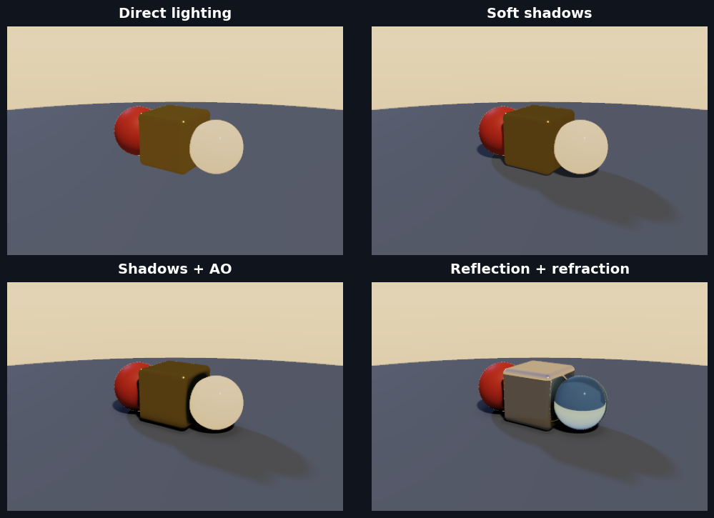
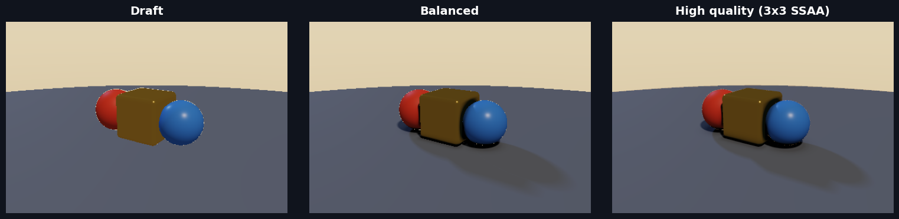

jaxCAD's image renderer is designed for predictable forward rendering. It uses
early-exit sphere tracing, hard surface visibility, finite-difference normals,
Cook–Torrance GGX materials, soft shadows, geometric ambient occlusion, and
optional reflection and refraction rays.

Geometry and constraints remain JAX-native and differentiable. Rendered pixels
are intentionally not an inverse-rendering or optimization API.

## Scene and quality settings

Use `Scene` for camera, lights, and environment data and `RenderSettings` for
the performance/fidelity trade-off:

```python
from dataclasses import replace

from jaxcad.render import Camera, RenderSettings, Scene, render_scene
from jaxcad.sdf.primitives import Sphere

scene = Scene(
    Sphere(1.0),
    camera=Camera(position=(0, 1.5, 5), target=(0, 0, 0)),
)

preview = render_scene(scene, RenderSettings.draft((240, 320)))
final = render_scene(scene, RenderSettings.high_quality((480, 640)))

# Presets are immutable; override only what a scene needs.
mirror = replace(RenderSettings.balanced(), reflect_steps=64)
```

The low-level `raymarch(sdf, ...)` function remains available for compact
notebook calls.

## Rendering modes

All panels below are produced by the forward renderer. Soft shadows stop as
soon as they find an occluder; AO samples actual scene geometry; and secondary
rays are enabled only when requested.



## Quality presets

- `draft`: shorter trace budgets, direct lighting, no secondary visibility, and one sample per pixel.
- `balanced`: more trace and shadow steps plus geometric AO.
- `high_quality`: tighter surface precision, more visibility samples, and 3×3 SSAA.



The presets are starting points rather than hidden modes. Every field is public,
validated, and can be changed with `dataclasses.replace`.
