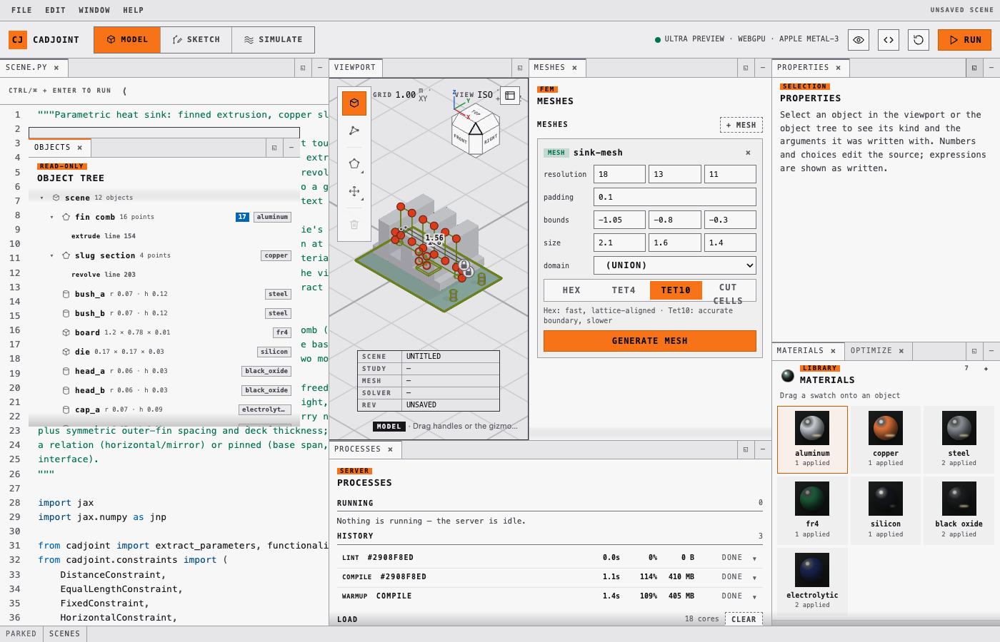
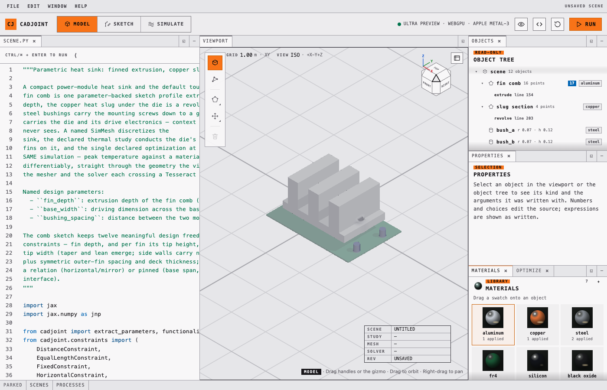
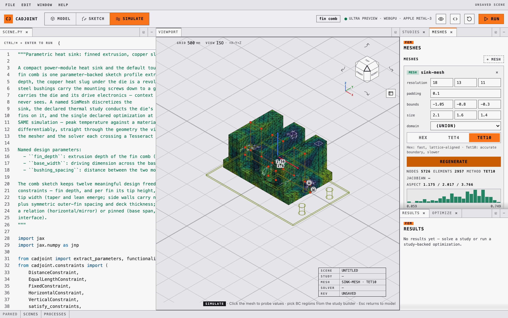
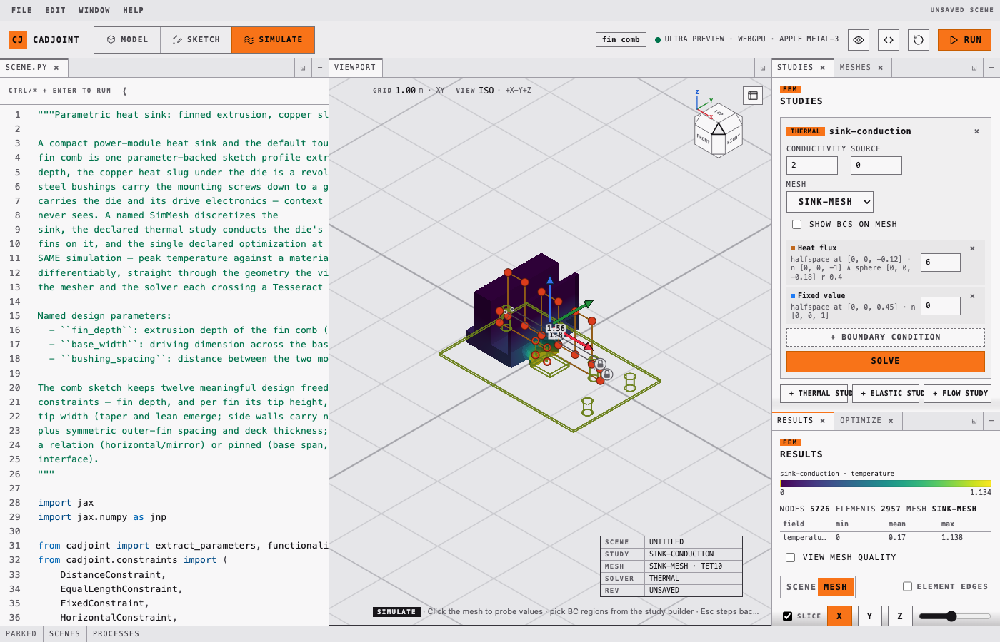
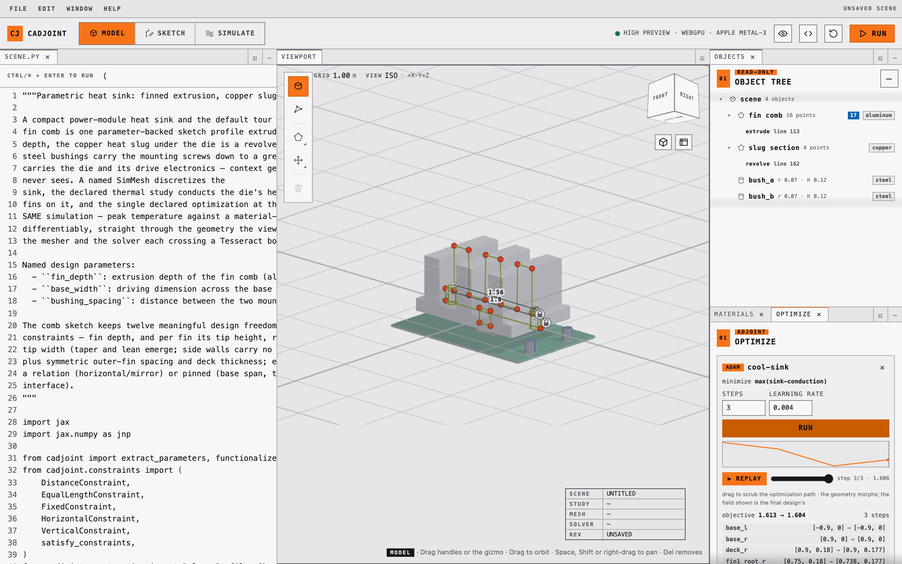

The playground is a local browser application: a Python editor on the left, a
live WebGPU viewport on the right, and a dock of panels that read and rewrite
the program in the editor. It is the interactive face of the whole toolchain —
the same `SimMesh`, `ThermalStudy`, and `Optimization` declarations that a
script runs are the ones the panels edit.

The single rule that makes it coherent: **the Python source is the only state.**
Dragging a sketch vertex, adding a boundary condition, or accepting an optimized
design all rewrite literals in the program. There is no hidden scene graph to
drift out of sync, and anything whose literals cannot be rewritten — geometry
built in a loop, or from a variable — still renders, but is read-only.

[](assets/screens/model-desk.png)

## Start it

```bash
uv run cadjoint-viewer --open      # serves http://127.0.0.1:8765/ and opens a browser
```

Equivalent invocations, and the flags:

```bash
uv run python -m cadjoint.viewer.playground   # same server, no browser launch
uv run cadjoint-viewer --port 9000            # pick a different port
uv run cadjoint-viewer --help
```

No extra dependencies are needed — the server is stdlib-only — but the viewport
needs a WebGPU-capable browser. Stop with `Ctrl+C`.

The starter program is a **parametric heat sink**: a fin comb extruded from one
constrained sketch profile, a revolved copper heat slug under the die, and two
press-fit steel bushings. It also declares a `SimMesh`, a thermal study, and an
optimization over the whole thing, so every part of the app has something real
to act on the moment it opens.

::: {.callout-warning}
The playground executes the editor contents as Python on your computer. It binds
only to localhost and protects compile requests with a per-session token, and it
compiles each edit in a timed child process so a failed edit cannot take down
the server — but it is not a sandbox. Only run code you trust.
:::

## One desk, many windows

Every panel is a **window**: the editor, the viewport, Objects, Materials,
Sketch, Meshes, Studies, Results, Optimize, Scenes and Processes. A window can
be moved, closed, minimised to a tray, tabbed with another, stacked, dragged to
split the desk, floated over the page and docked back. The WebGPU canvas keeps
its context through all of it — the viewport is repositioned, never re-parented
— and the arrangement is persisted in the browser, with Window ▸ Reset layout to
get the default back.

The toolbar's three-cell switcher — `M` cycles it, `Esc` returns to Model —
picks a **desk**: a default arrangement of windows and the tool set the rail
offers, the way Blender scopes its tools to a mode.

| Desk | Opens by default | Tools on the rail |
|---|---|---|
| **Model** | Editor, viewport, Objects, Materials, Optimize | Select, place box / sphere / cylinder, sketch on a face, move and rotate gizmos, delete |
| **Sketch** | Editor, viewport, Objects, Sketch | Everything in Model, plus polygon editing, modify, and constraint annotation |
| **Simulate** | Editor, viewport, Studies with Meshes tabbed behind it, Results with Optimize tabbed behind | None — the viewport becomes a picker for boundary conditions |

Simulate is not a second application. Meshes, Studies, Results and Optimize are
ordinary windows on the same desk as everything else, and Window ▸ opens any of
them from any desk; the desk only decides which are open when you arrive.
Scenes and Processes are parked in the tray on every desk rather than docked on
any, because a browser or a monitor that took a column before you asked for it
would be in the way of the work. Selecting a sketch profile in the viewport
auto-enters the Sketch desk once; `Esc` or the switcher leaves again.

All three desks share one accent. Which one you are on is read from the
position of the filled cell in the switcher, the word in the hint bar, and the
tool set — not from a hue, because colour in this app is reserved for data.

Rendering is deliberately *not* a desk. Presets, shading, shadows, quality and
the views of the field live in a popover behind the eye icon, which opens from
any desk — how the scene is drawn is orthogonal to what you are editing.

[](assets/screens/windows-float-stack.png)

## Modelling

Construction geometry — sketch profiles and primitives — draws over the rendered
solid as a depth-tested wireframe, so an edge behind the model is hidden by it.

| Action | Result |
|---|---|
| Click a vertex handle | Selects it and highlights the exact literal in the code |
| Drag a handle | Rewrites that vertex's coordinates and rebuilds the solid |
| **Polygon** (`P`), then click edges | Inserts a vertex per click until `Esc` |
| Select a handle, press `Del` | Removes that vertex |
| **Box** / **Sphere** / **Cylinder** (`B` / `S` / `C`), then click | Writes a `Solid.*` call into the program |
| Click a solid's outline | Selects it and shows the gizmo |
| Drag a gizmo arrow or ring | Rewrites `position=` or `rotation=` |
| Drag empty space / Shift-drag / scroll | Orbit / pan / zoom |
| Click a face of a solid | Highlights it; **New sketch on face** plants a sketch there |

`O` and `V` switch between selecting whole objects and selecting sketch
vertices; `G` and `R` switch the gizmo between move and rotate.
`Ctrl/⌘ + Enter` runs the program, `Ctrl/⌘ + Z` undoes the last source change.

### Finding your way around

The world is **Z-up**, as every scene is, and the viewport defaults to
orthographic projection — `5` toggles perspective. A **floor grid** on `z = 0`
rules the ground with one honest 1-2-5 spacing readout that follows the zoom,
and a title block names the scene and the view; an empty viewport rules the
floor rather than rendering black.

The **navigation cube** in the corner is a chamfered cube in the FreeCAD
lineage: its six faces, twelve bevels and eight corners are the twenty-six
standard views, each a real facet you can press, and the flank controls turn a
quarter about the camera's own axes. Shift-click a facet for the view directly
opposite — from above the floor there is never a BOTTOM to click, but its far
side is one Shift away. `1`, `3` and `7` are front, right and top (with `Ctrl`
for back, left and bottom), and `9` turns to the opposite side.

One **construction-overlay switch** hides everything the app draws *about* the
model rather than *of* it — construction edges, sketch handles, the gizmo,
constraint marks and their dimension labels, the boundary-condition preview —
for a presentation state that is the solid, the field and the floor and nothing
else.

[](assets/screens/construction-overlay-off.png)

### Sketching on a face

The compile payload lists every construction node's *analytic* faces — read off
the construction tree, never off the render mesh — each with its plane frame,
its world-space boundary polygon, a hit tolerance, and the accessor that names
it in source. Hover resolution happens in the browser: the raymarch hit is
tested against those polygons, so highlighting costs no round trip.

Planting a sketch does take one. The viewer posts a `set_sketch_plane` patch
naming the face — the feature's line plus which face of it — and the server
rewrites the sketch's `plane=` argument to `SketchPlane.on(body.cap("+"))`,
`SketchPlane.on(block.face("+z"))`, or, when the hit landed on a curved surface
with no face to name, `SketchPlane.tangent(body, near=[...])`.

What gets written is the *reference*, never the coordinates it currently
evaluates to. Re-dimension the parent and the sketch moves with it, and the
gradient of anything downstream still reaches the parent's `depth` — see
[faces as references](getting-started.qmd#faces-are-references-not-geometry).
A sketch can only sit on geometry the program builds before it; the server
refuses the patch otherwise rather than writing a `NameError`.

## Simulating

Four windows — Meshes, Studies, Results and Optimize — work over the same
declarations a script would read; the Simulate desk opens them, and Window ▸
opens any of them anywhere else. Every edit goes through the same source-patch
round-trip as the sketch tools; solving posts the study's *name*, and the
server re-derives everything from the declaration. Every option they offer —
mesh method, study kind, boundary-condition type, objective metric, gradient
path — is one of the `cadjoint.enums` option sets, so the window's choices,
the validator's rejections and the generated TypeScript unions are the same
list.

**Meshes** declares and regenerates `SimMesh` objects. Resolution, padding,
bounds, size, and the Hex / Tet4 / Tet10 method are editable inline; regenerating
reports node and element counts and shades the mesh by element quality with a
histogram beside it. A tet mesh that had to climb the
[refinement ladder](meshing.qmd#the-refinement-ladder) says which grid it was
actually built on.



**Studies** holds the study declarations, their materials, and their boundary
conditions — and this is where the viewport becomes a picker. Clicking the
surface proposes a `Nodes.sphere` selection sized from the mesh spacing;
shift-dragging a rectangle proposes a `Nodes.box` from the world-space bounds of
the vertices inside it. The proposal is written into the program as a real
selection expression, so a BC picked by hand is indistinguishable from one typed
by hand, and it re-resolves against whatever the mesh becomes. A study with no
`conductivity=` (or `youngs=` / `poisson=`) takes the property from the
scene's [materials](materials.qmd), sampled per element at solve time.



**Optimize** runs the declared `Optimization` objects, streaming each step's
objective and gradient norm as it arrives. When a run finishes it lands in a
player: a convergence sparkline with a moving cursor, play/pause, and a scrubber
that replays the geometry along the trajectory by substituting each step's
parameter snapshot and ghost-compiling it. Only the adopted final source ever
touches undo history. While it runs, a chip in the mode strip shows what is
running and for how long, wherever on the desk you happen to be looking.



**Results** browses the solved surface — a field picker that swaps displayed
scalars without re-solving, a deformed view for elastic results, per-vertex BC
previews, and an axis-aligned slice plane. The field is drawn in the viridis
ramp and nothing else in the app is, so colour on screen always means data.

## Materials

A `Material` carries two families of property in one object: the optical ones
the renderer shades with (`color`, `roughness`, `metallic`, `opacity`, `ior`,
`reflectivity`) and the physical ones the simulation solves with, in SI —
`density`, `conductivity`, `specific_heat`, `youngs_modulus`, `poisson_ratio`,
`thermal_expansion`, `yield_strength`. Optical properties always have a value;
physical ones default to *unspecified*, so a scene that only cares about looks
never has to invent a Young's modulus.

Both families are editable from the inspector through one operation,
`set_material_property`, which names the material by its stable id, its payload
index, or its name, and carries the property and a number:

```json
{"op": "set_material_property", "id": "assign:copper",
 "property": "youngs_modulus", "value": 1.185e11}
```

The physical half is why the operation exists rather than reusing `set_value`.
An unspecified property has no keyword in the call and therefore **no span** in
the payload, so there is nothing for the inspector to drag — the material
payload publishes `physical` (the value, or `null`), `units`, `free`, and a
`spans` entry only for the properties actually stated. A row with no span is a
row the inspector offers to *state*: the same request with a number adds the
keyword to the call. Sending `"value": null` takes it back out, returning a
physical property to unspecified and an optical one to its default.

Values are checked against the same brackets `Material` enforces when
`free=True`, so a number the viewer accepts is one the optimizer accepts, and a
rejection names the unit it was measured in — `` `density` must be a number
from 1 to 25000 kg/m^3. ``

| Property | Range | Unit |
| --- | --- | --- |
| `density` | 1 – 25000 | kg/m^3 |
| `conductivity` | 0.001 – 3000 | W/(m·K) |
| `specific_heat` | 1 – 10000 | J/(kg·K) |
| `youngs_modulus` | 1000 – 1e12 | Pa |
| `poisson_ratio` | 0 – 0.499 | — |
| `thermal_expansion` | 0 – 0.001 | 1/K |
| `yield_strength` | 1000 – 1e11 | Pa |
| `roughness`, `metallic`, `opacity`, `reflectivity` | 0 – 1 | — |
| `ior` | 1 – 3 | — |

The edit is span surgery like every other: the keyword is written on the line
of the argument it follows, so no line number moves — unless that would push
the line past 100 columns, in which case the keyword wraps onto its own line
and the file grows by exactly one.

A material built by a [catalogue](materials.qmd) factory — `alu =
aluminium_6061()` — has no property keyword to edit, and the operation says so
rather than guessing. Sending the same request again with `"expand": true`
rewrites the binding as the literal `Material(...)` the factory builds, one
keyword per line, and then applies the edit; from there every property is an
editable row. Only the cheap conversion is done: a bare, argument-free factory
call, whose result the server can build and read without executing any of the
user's own code.

## Looking at the field

The solid is one way to look at a signed distance field, and the render
popover offers four more. All of them are branches inside the same generated
shader, views of the one SDF the solid is traced from, so there is no second
scene to fall out of step.

| View | Shows |
|---|---|
| **Solid** | The raymarched surface everything else in the app assumes |
| **Slice** | The signed value of the field on a plane, inside and outside, with isolines that tighten toward the boundary — the part's own section outline is the `f = 0` contour |
| **∇f** | The gradient magnitude on the same plane: `|∇f| = 1` is a true distance, and anything else is where a blend, a scale or a twist has stopped it being one |
| **N** | World-space normals on the surface |
| **Z** | Linear camera depth |

The slice plane takes any axis and sweeps a slab of ±2 units about the origin;
the legend prints the plane's actual coordinate, and both slice views draw
their isolines one pixel wide at every zoom. The slice is data, so it is
composited after tone mapping in the achromatic ink the chrome uses, and the
field values are read from the same shader `sdf()` the primary rays march.

An **iso-offset** slider traces the solid at `f = c` instead of `f = 0`: a
positive offset dilates the part, a negative one erodes it. It is applied to
every `sdf()` read — primary rays, shadows, normals — so the offset surface
shades and casts like a real surface rather than a shell drawn over the old
one, which makes it a quick check of a wall thickness or a clearance.

## Rendering

The eye icon opens the render popover. It carries three editable presets —
**X-Ray** for modelling and inspection, **Studio** for clean path-traced
materials, **Wire** for construction geometry only — over independent switches
for shadows, reflections, feature edges, and the dual-contour wireframe. Presets
are stored in the browser and can be edited and saved.

The two mesh overlays are one extraction, and neither of them is the lattice.
Turning either on asks the server for a boundary representation of the scene on
the viewport's own 64³ grid — faces are the regions one patch field owns, edges
are where two of them meet — and both layers are read off it. The **wireframe**
draws the dual-contour quads, on vertices re-solved by the projection kernel so
a vertex on a CSG seam sits on the seam. **Feature edges** draws the graph's
edges, and it *traces* them rather than sampling them: where two surfaces
cross, the direction of their intersection is the cross product of the two
normals, so each edge is followed from one corner to the next, stepping along
that direction and correcting back onto both surfaces. The grid is asked only
where an edge starts. A bore rim is therefore a circle whose radius is right to
a millionth of a unit, it stays that circle wherever the cells happen to fall,
and the step shortens where the curve bends — so a rim narrower than one cell
is still round, not an octagon. Curves run into their corners and meet there
exactly.

A rounded corner is still an edge if the rounding is finer than the overlay can
show. The grid puts one vertex where a sub-cell fillet is, so its edge is drawn
where the sharp corner would have been — which is what a bracket filleted at
0.02 looks like on screen, and where its bore rims come from. Round a corner by
more than a cell and it becomes curvature the viewport genuinely renders, and no
line is drawn inside it. See
[the B-rep architecture note](../research/brep-architecture.md) §8.1.

Path tracing accumulates progressively: one jittered camera sample per pixel per
frame, averaged in linear HDR, with cosine-weighted diffuse and
importance-sampled GGX reflection, Schlick-Fresnel glass, finite-sun next-event
estimation, multi-bounce environment lighting, Russian-roulette termination, and
ACES tone mapping in a separate presentation pass. Accumulation resets
automatically when the scene, camera, viewport, or mode changes.

Quality is a three-step budget. **High** is the default at roughly 900,000
pixels, six bounces, two sun-visibility samples per hit, and 512 samples per
pixel; **Draft** drops to 320,000 pixels, three bounces, one visibility sample,
and 128 samples; **Ultra** opts into 1.6 million pixels, eight bounces, four
visibility samples, and 1,024 samples.

Two half-float textures alternate between sampled input and render attachment.
WebGPU does not allow one texture to be sampled and rendered into in the same
pass, so this ping-pong is required rather than incidental. The finite sun is
sampled only through next-event estimation and is not part of the environment
radiance seen by BSDF paths, so the strategies do not overlap; multiple
importance sampling becomes useful only once emissive area lights or an
importance-sampled environment map are added. The scope decisions are recorded
in [WebGPU SDF path tracing](../research/path-tracing.md).

## Export

**File ▸ Export…** writes one object of the program as a file, in the formats
the library already exports: `STL` (binary or ASCII), `OBJ` (coplanar quads
merged into n-gons), `STEP` and, once the program declares a study, `VTK`. The
dialog asks for the format, the object — any module-level variable bound to an
SDF, `scene` by default — and the lattice resolution in cells along the
object's longest axis; the lattice is fitted to the object the same way a
`SimMesh` without explicit bounds is. STEP is not a faceted mesh with a
`.step` extension: it is written from the derived B-rep, so planes and
cylinders are exact with their real edge curves and only blend faces are
faceted (`analytic` off asks for the faceted writer instead). VTK takes a
declared study rather than an object and writes its solved mesh and fields
for ParaView, solving first if the program has not. The run is a job like a
solve — the chip beside the mode switcher counts it and can cancel it, and
the Processes window lists it — and the browser saves the file under the
scene's name (`heatsink-scene.stl`). The endpoint is `POST /api/export`; a
success is the file itself with `Content-Disposition` and the job id in
`X-Cadjoint-Job`, a failure the usual JSON.

## Compilation path

Each run follows the same path as the shader backend:

1. The local server evaluates the Python in a child process and reads `scene`.
2. JAX traces distance and material evaluation and lowers both to StableHLO.
3. cadjoint emits WGSL `sdf`, `material_base`, and `material_optics` functions.
4. The browser embeds those in the preview or path-tracing runtime and builds
   the WebGPU pipelines.

The code icon shows the complete generated WGSL. Python tracebacks and WGSL
compiler errors appear under the editor.

Every request runs in a fresh child process, so nothing would survive between
edits by default. Two things make the second edit cheaper than the first. The
worker turns on JAX's **persistent compilation cache** under
`~/.cache/cadjoint/jax` (`CADJOINT_CACHE_DIR` to move it,
`CADJOINT_NO_COMPILATION_CACHE=1` to opt out), so a program compiled once is
reused by every later process; and the scene is traced with its parameter
values as *arguments* rather than literals, so a re-dimensioned design lowers
to the same program and hits that cache. Measured on the starter scene, a
compile fell from 2.1 s to 1.0 s and a mesh overlay from 12.2 s to 5.8 s
warm. The server warms the cache for every shipped scene at start — those are
the `warmup` jobs in the Processes window — so the first overlay you ask for
does not pay the cold cliff. The FEM paths gain nothing from it: a jax-fem
solve runs in PETSc, outside XLA. See
[program size](meshing.qmd#program-size) and the
[performance notes](../research/performance.md).

## Code parity

The source is the single truth: every viewer action is a rewrite of a span of
the user's Python, and the payload the viewer draws is read back out of that
same text. Three things hold that contract together.

### Stable identities

A payload entry used to be addressed by the line it sat on at the last compile.
Any edit between the compile and the click — a blank line, an import, an
`add_sketch` that inserts three lines — moved every line and silently aimed the
next patch at the wrong statement.

Every addressable thing now also carries a **stable id**, derived from its AST
path and the name the program assigned it rather than from its position:

| Id | Names |
|---|---|
| `assign:comb_profile` | The call that is the value of a module-level assignment — sketches, primitives, features, materials, studies, meshes, optimizations |
| `call:extrude@comb_profile` | A feature call bound to no variable, keyed by the sketch it consumes |
| `sketch:comb`, `box:block` | An unbound construction call carrying a literal `name=` |
| `bc:sink-conduction[1]` | An ordinal inside its owner — also `constraint:<sketch>[i]`, `vertex:<sketch>[i]` |
| `plane:comb_profile`, `face:sink:cap+` | A sketch's work plane; one analytic face of a feature |

Ids survive every edit that does not touch their own statement. Only the
`#<n>` fallback — an object with neither a variable nor a `name=` — is ordinal,
and every statement the viewer itself writes is named.

Every `/patch` request takes `id` wherever it used to take `line`, and the id
wins: it is resolved against the text in that same request, so a stale line
cannot survive the round trip. The old fields still work unchanged, and the
compile payload carries both — `stableId` on every entry, plus an `identities`
table mapping each id to the line it currently sits on.

### A schema, and types generated from it

The payload is defined once, as pydantic models in `cadjoint/viewer/schema/`.
The compile worker validates every payload against them before answering, and
`cadjoint/viewer/schema/payloads.d.ts` is generated from the same models — one
interface per payload shape, and one per `/patch` operation, discriminated on
`op`. Regenerate it with:

```bash
python -m cadjoint.viewer.schema.emit
```

A test regenerates and diffs, so the models and the checked-in types cannot
drift apart.

### The round-trip invariant

`tests/viewer/test_parity_roundtrip.py` closes the loop for all 28 operations:
for each generated request the patched text must still parse, patching twice
from the same input must be byte-identical, the id and the legacy line must
produce the same source, and compiling the result must show exactly the change
that was asked for. Operations that describe a state rather than a step —
every `set_*` — must additionally be idempotent.

## Editor intelligence

The editor lints and completes as you type. Both analysers are *static* — they
read the program without importing or running it — so they are safe to fire on
every keystroke, unlike compilation, which needs its disposable child process.

Three endpoints back it, all answered in the server process:

| Endpoint | Backed by | Warm latency |
|---|---|---|
| `POST /api/lint` | the `ruff` binary, `--isolated` | ~6 ms |
| `POST /api/complete` | `jedi`, warm per server process | ~15 ms |
| `POST /api/signature` | `jedi.Script.get_signatures` | ~2 ms |

Every line in these requests and responses is **1-based** and every column is
**0-based** — CodeMirror's and jedi's own convention.

Diagnostics carry a `severity` of `error`, `warning` or `info`, so the gutter
markers and underlines are colour-coded: a syntax error or an undefined name is
red, a probable mistake such as an unused import is amber, and an import-order
or modernisation remark is blue. Where ruff knows a fix, the diagnostic carries
its text and edits, and the editor offers it as an action.

The most valuable diagnostic is not static at all. When a `/compile` fails with
a traceback that names a line of your scene, that failure is remembered and
folded into the next lint of the *same* text — the line that actually blew up
gets a red squiggle. Editing anything invalidates it, so it never outlives the
code that caused it.

Completions resolve against the **installed** `cadjoint`, so they know its real
types: `SketchPlane(` offers `origin=` and `normal=` with their defaults,
`plane.` offers `to_world`, `frame`, `rotation_matrix`, and each entry's popup
carries the signature and docstring. Jedi pays a few hundred milliseconds for
its first analysis; the server primes it on a background thread at startup so
the first popup you see is already warm.

Both tools are optional extras (`pip install "cadjoint[editor]"`). Without them
these endpoints answer with an install hint and the editor simply goes quiet.

## Work that outlives the request

Every request that costs real time — a compile, a mesh extraction, a mesh
inspection, a simulation, an optimization run, a lint, and the startup
warm-up — is registered as a **job** in the server process the moment it
starts, and stays registered after it ends. Nothing about the endpoints
changes: they answer exactly as before, with a `job_id` added.

That id buys three things a plain request/response API cannot give you.

**A result survives the panel that asked for it.** Switch modes, close the
Results tab, come back an hour later: `GET /api/jobs/<id>/result` returns the
identical payload the original request received, byte for byte, without
re-running a nine-second solve. Each job also carries the sha256 of the
program text it ran on, so the UI can tell a result that still describes the
document from one the last edit invalidated.

**You can see what is burning the machine.** While a job runs, its worker
subprocess (and anything that worker spawns, such as a CalculiX solve) is
sampled twice a second for CPU and resident memory. `GET /api/jobs` answers
with every job newest-first plus live totals — how many are running, their
combined CPU and RSS, the server's uptime, and the machine's core count and
memory — cheaply enough to poll once a second. The startup warm-up appears
as a `warmup` job, which is the answer to "why are two Python processes at
100% the moment I open the playground?".

**A run can actually be stopped.** `POST /api/jobs/<id>/cancel` kills the
worker subprocess rather than merely abandoning it; the request that started
the work ends immediately with `{"ok": false, "error": "cancelled"}` and the
job is marked `cancelled`. `POST /api/jobs/clear` drops finished jobs.

The registry is a fixed-size window, not a log: the last 50 jobs (at most 10
of them lints, so a typing session cannot flush the expensive history), and
64 MB of stored payloads. Past either bound the oldest finished entries go —
payloads first, so a job's timings and samples outlive its result. Every
listing reports both budgets and how much has been evicted.

In the UI this is the **Processes** window. It is parked in the tray of
every desk rather than docked — a monitor that took a column of the desk
before you asked for it would be in the way of the work it monitors — and it
opens from the tray or from Window ▸ Processes. It has three zones: `01
RUNNING`, one row per job with its elapsed time, CPU, memory and a cancel
control (an optimization also shows its step and objective); `02 HISTORY`,
what finished, newest first, where clicking a solve, mesh inspection or
optimization re-opens that result in the panel that draws it; and `03 LOAD`,
the totals, a minute of worker CPU, and how much of the store's budget is
used. It polls once a second while it is open, and not at all while it is
not.

The panels do their half of the same bargain. The Simulate panel's Results
tab, the mesh inspection and an optimization run each remember only the job
id, the source hash and the request's name, and fetch the payload back when
they mount again — so closing the Results window, or leaving the Simulate
desk, and coming back no longer costs a second solve. A result whose hash no longer matches the editor is kept and
marked `stale · source changed` rather than discarded, and a result the
server has evicted says so and offers the run again.

Sampling uses `psutil`, part of the `viewer` extra. Without it the server
still registers everything and still cancels; it falls back to
`resource.getrusage` totals over all child processes and says so in each
payload's `sampling` field, which reads `"psutil"` or `"rusage"`.

## Scenes

**File ▸ Open…** raises the **Scenes** window, a browser over the `scenes/`
directory under the server's working directory — the repository's own scene
directory when you start from a checkout, or wherever `CADJOINT_SCENES_DIR`
points. Each card carries a thumbnail, the first paragraph of the file's
docstring, its size and modification time, and counts of what it declares:
named and free design parameters, studies, meshes, optimizations, and the
materials it defines.

All of that is read with `ast`, never by executing the file. A browser that ran
every program in a directory to describe it would be a browser that runs
arbitrary code on a directory listing, which is not a trade the server makes
anywhere else either. The thumbnails are the one thing that does cost a
compile: they are rendered serially in the browser from each scene's own
compiled shader and cached, so the directory is described instantly and drawn
as it goes.

Opening a scene replaces the editor's text (an unsaved buffer asks first);
**File ▸ Save** and **Save As…** write back into the same directory, and the
endpoints — `GET /api/scenes`, `POST /api/scenes/load`, `POST
/api/scenes/save` — accept bare `*.py` names only. Path separators, traversal
and hidden files are refused before anything touches the filesystem.

## A live example

::: {.callout-note}
WebGPU requires localhost or HTTPS and a browser/platform combination with an
available GPU adapter. The viewer reports adapter, device, context, shader, and
device-loss failures directly over the canvas. Firefox enables WebGPU by default
on Windows and Apple-silicon macOS; Linux support remains
[Nightly-only](https://developer.mozilla.org/en-US/docs/Mozilla/Firefox/Experimental_features).
:::

<link rel="stylesheet" href="assets/webgpu-viewer.css">

<div class="cadjoint-webgpu-demo" data-cadjoint-webgpu-viewer>
  <canvas data-viewer-canvas aria-label="Interactive WebGPU rendering of the cadjoint orbital example"></canvas>
  
  <div class="cadjoint-webgpu-status" data-viewer-status aria-live="polite">Starting WebGPU…</div>
  <button class="cadjoint-webgpu-reset" data-viewer-reset type="button">Reset camera</button>
  <div class="cadjoint-webgpu-help">Drag to orbit · Scroll to zoom</div>
</div>

<script type="module" src="assets/webgpu-viewer.js"></script>

The canvas above runs a cadjoint scene directly in this page — its shader was
compiled from Python through StableHLO to WGSL and stored. Drag to orbit, scroll
to zoom. The documentation is static, so editing and executing Python stays in
the local playground.

## Jupyter widget

For a compact viewer inside a notebook rather than a full application:

```bash
uv sync --extra viewer
```

```python
from cadjoint.sdf.primitives import Sphere
from cadjoint.viewer import SDFViewer

viewer = SDFViewer(Sphere(radius=1.0), height=480)
viewer
```

It supports orbit, zoom, pan, and camera reset. Recompile an existing widget
after changing a scene without recreating its output cell:

```python
viewer.update_scene(new_scene)
```

See the [rendering notebook](../examples/rendering.ipynb) for a complete
composition and hot-reload example.

## Developing the UI

The app is a Solid + TypeScript project in `frontend/`, built into
`cadjoint/viewer/static` and committed, so installing cadjoint needs no Node
toolchain.

```bash
cd frontend
npm install
npm run dev        # Vite on :5173, proxying the API to the Python server
npm run build      # refresh cadjoint/viewer/static (commit the result)
npm test           # projection and picking unit tests
npm run e2e        # Playwright, drives the real server end to end
```

Run `uv run cadjoint-viewer` alongside `npm run dev` so the dev server has an API
to proxy to.

## Troubleshooting

**WebGPU is unavailable.** Use a WebGPU-capable browser with hardware
acceleration enabled. The editor can still compile and show the generated WGSL
when no adapter is available.

**The command is not found.** Run `python -m cadjoint.viewer.playground --open`,
or reinstall the current checkout so the `cadjoint-viewer` console script is
created.

**A scene does not compile.** Confirm the program assigns an SDF to a variable
named `scene`. The error panel carries the Python traceback or WGSL compiler
message.
