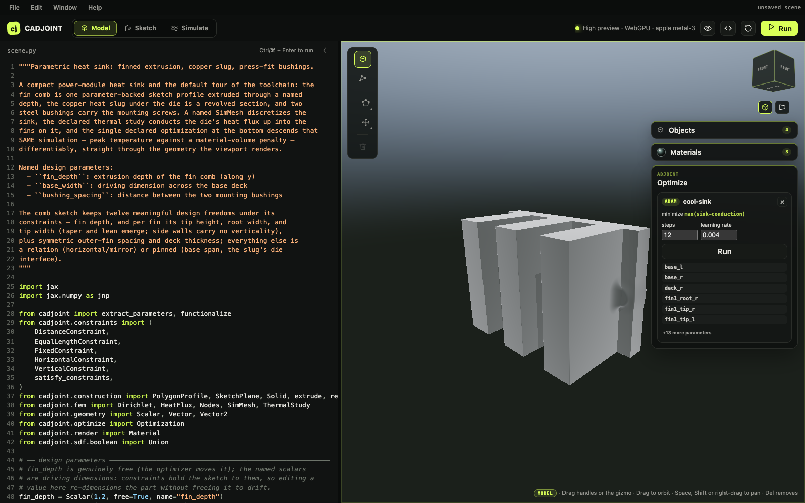

**Differentiable code-first CAD.** Sketches, constraints, SDF geometry, meshing,
and finite-element simulation compose into one function JAX can differentiate
end to end — from the first named dimension to the last solver residual.

::: {.callout-warning}
The API is not stable. Expect breaking changes.
:::

[](docs/viewer.qmd)

Everything above happens in the browser: model the part, mesh it, declare the
physics, and descend the objective, with every edit written back into the Python
source that produced it. [Open the playground guide](docs/viewer.qmd).

## The layers

| Layer | What it does |
|---|---|
| **Geometry** | Parametric `Vector` / `Scalar` carrying `free` / `fixed` flags |
| **SDF** | Primitives, boolean ops, and transforms — all differentiable |
| **Sketches** | 2D profiles on work planes, extruded or revolved into solids that share their parameters |
| **Constraints** | Geometric relationships that reduce DOF, with Newton projection onto the constraint manifold |
| **Functionalize** | Convert a parametric scene to a pure JAX function for `jit` / `grad` / `vmap` |
| **[Meshing](docs/meshing.qmd)** | Dual contouring built bottom-up in JAX; exact gradients through every continuous stage; OBJ / STL / STEP export |
| **[Simulation](docs/simulation.qmd)** | Declared `SimMesh` and thermal/elastic studies, node selections, and pluggable solver backends |
| **[Optimization](docs/optimization.qmd)** | Declarative descent over named CAD parameters with the simulation as objective |
| **[Tesseracts](docs/tesseracts.qmd)** | Rust, Fortran, and non-differentiable meshers packaged so one `jax.grad` crosses them all |
| **[Rendering](docs/rendering.qmd)** | Forward sphere tracing, plus StableHLO → WGSL shader compilation |
| **[The playground](docs/viewer.qmd)** | The whole toolchain as a browser app, with the Python source as its only state |

## The chain

```
CAD parameters θ  ──►  constraints ──► SDF        (JAX autodiff)
        │                              │
        │                              ▼
        │                  dual-contoured surface   (JAX autodiff:
        │                              │             Newton on the true SDF)
        │                              ▼
        │              ┌─ tetfill Tesseract ─────┐ (TetGen; frozen topology,
        │              │  surface → TET4/TET10   │  exact pass-through VJP)
        │              └───────────┬─────────────┘
        │                          ▼
        │              ┌─ solver Tesseract ──────┐ (jax-fem adjoint, or
        │              │  thermal / elastic FEM  │  CalculiX Fortran adjoint)
        │              └───────────┬─────────────┘
        │                          ▼
        └──────────  ∂J/∂θ  ◄──  objective J      (JAX autodiff)
```

No two stages agree on how to compute a derivative, and one of them cannot be
differentiated at all. On the parametric L-bracket the composed loop drops the
objective 73% in 30 steps, with the adjoint checked against finite differences
at every boundary.

## Quick start

Three distance constraints fully determine an unknown point, and the solved
scene is an ordinary JAX function afterwards.

```python
import jax.numpy as jnp
from cadjoint import extract_parameters, functionalize
from cadjoint.constraints import DistanceConstraint, solve_constraints
from cadjoint.geometry.parameters import Vector
from cadjoint.sdf.primitives import Sphere
from cadjoint.sdf.transforms import Translate

# Unknown point — wrong initial guess
p = Vector(jnp.array([0.5, 0.5, 0.0]), free=True, name="p")
scene = Translate(Sphere(radius=0.5), offset=p)

# Fixed anchors
anchor_a = Vector(jnp.array([0.0, 0.0, 0.0]), free=False, name="a")
anchor_b = Vector(jnp.array([4.0, 0.0, 0.0]), free=False, name="b")
anchor_c = Vector(jnp.array([2.0, 3.0, 0.0]), free=False, name="c")
true_p = jnp.array([2.0, 1.0, 0.0])

for anchor in (anchor_a, anchor_b, anchor_c):
    DistanceConstraint(p, anchor, float(jnp.linalg.norm(true_p - anchor.value)))

solved = solve_constraints(scene)
_, fixed, _ = extract_parameters(scene)
sdf = functionalize(scene)(solved, fixed)

print(sdf(true_p))  # ≈ -0.5 — the solved sphere is centred on the true point
```

Then [get started](docs/getting-started.qmd) for the rest of the arc.
